# Лаба 1 — Свой Docker

Цель лабы — разобрать контейнер на части. Берём обычный процесс и по одному
навешиваем на него механизмы ядра: namespaces (что процесс видит), cgroups
(сколько он может потребить), capabilities и seccomp (что ему разрешено).
Потом собираем всё это в один скрипт `mydocker.sh`, сравниваем его с настоящим
`docker run`, доходим до образов, gVisor и мониторинга.

- **Язык сервиса:** Go 1.27
- **Хост:** VM Ubuntu 24.04 LTS

---

## Часть 0. Сервис

| Эндпоинт | Зачем в лабе |
|---|---|
| `GET /health` | отвечает `ok` — сервис жив и доступен |
| `GET /eat?mb=N` | выделяет N МБ и пишет в каждую страницу — для лимита памяти и OOM |
| `GET /burn?n=N` | крутит N потоков в бесконечном цикле — для throttling CPU |
| `GET /stop`, `GET /free` | сброс между прогонами |
| `GET /info` | pid, uid, hostname, cgroup, capabilities, seccomp — состояние изоляции глазами самого процесса |
| `GET /openapi.yaml` | контракт API (OpenAPI 3.1), вшит в бинарник |
| `GET /docs` | Swagger UI поверх контракта, тоже вшит в бинарник |

Сборка и запуск — через `Makefile`. Нужны Linux, Go 1.27 и make:

```bash
make build                       # статический бинарник bin/api
make run                         # собрать и запустить на :8080
make smoke                       # дёрнуть все эндпоинты запущенного сервиса
make vet                         # go vet и проверка gofmt
ADDR=127.0.0.1:8080 ./bin/api    # адрес задаётся переменной ADDR
```

Собираем и проверяем все эндпоинты разом:

```bash
make build
make smoke
```

```text
cd api && CGO_ENABLED=0 go build -ldflags="-s -w" -o ../bin/api .
-rwxrwxr-x 1 user user 8.0M Oct  1 16:32 bin/api

GET /health       -> ok
GET /eat?mb=64    -> held 64 MB
GET /burn         -> burning on 1 core(s), GET /stop to stop
GET /stop         -> stopped 1 burner(s)
GET /free         -> released, holding 0 MB
GET /openapi.yaml -> openapi: 3.1.0
GET /docs         -> 200, 1105 bytes
GET /docs/swagger-ui-bundle.js -> 200, 1452753 bytes
```

Бинарник статический и весит 8 МБ, все эндпоинты отвечают.

---

## Часть 1. Запуск без изоляции

Задача — запустить сервис прямо на хосте и записать, что видит и может взять
процесс без всякой изоляции. Это точка отсчёта: в следующих частях изоляцию
будем доказывать тем, что эти значения изменились.

### Окружение

Сначала проверяем, на чём работаем: ядро, cgroup v2, Go.

```bash
hostname; grep PRETTY /etc/os-release; uname -r; nproc; free -m | head -2
stat -fc %T /sys/fs/cgroup
cat /sys/fs/cgroup/cgroup.controllers
go version
```

```text
froggy
PRETTY_NAME="Ubuntu 24.04.5 LTS"
6.8.0-139-generic
2
               total        used        free      shared  buff/cache   available
Mem:            1966         326        1550           1         237        1640
cgroup2fs
cpuset cpu io memory hugetlb pids rdma misc
go version go1.27.1 linux/amd64
```

`cgroup2fs` означает единую иерархию cgroup v2, и нужные контроллеры `cpu`, `memory`, `pids` в ней есть.

### Запуск

Запускаем сервис. Сразу привязываем его к `127.0.0.1`.

```bash
ADDR=127.0.0.1:8080 ./bin/api
```

```text
2026/10/01 16:32:58.337880 api starting: pid=1578 ppid=1420 uid=1000 gid=1000 host=froggy cpus=2 addr=127.0.0.1:8080
```

Во втором терминале находим процесс. `pgrep -x` ищет по точному имени.

```bash
PID=$(pgrep -x api); echo "PID=$PID"
ps -o pid,ppid,user,nlwp,rss,comm -p $PID
```

```text
PID=1578
    PID    PPID USER     NLWP   RSS COMMAND
   1578    1420 user        6  9948 api
```

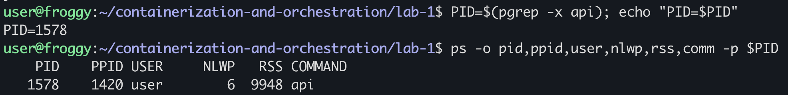

С ноутбука прокидываем порт через `ssh -L 8080:127.0.0.1:8080 <vm>` и
открываем сервис в браузере:

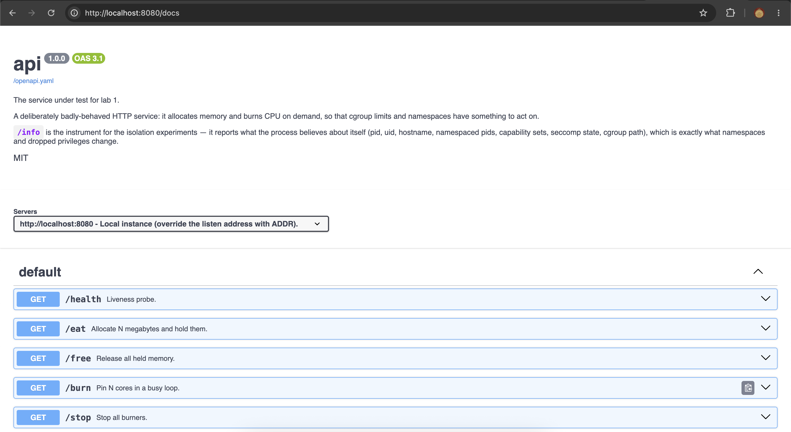

### Точка отсчёта

Теперь снимаем то, с чем будем сравнивать дальше: namespaces, cgroup и права.

```bash
ls -l /proc/$PID/ns
cat /proc/$PID/cgroup
grep -E '^(Uid|NSpid|Cap|NoNewPrivs|Seccomp)' /proc/$PID/status
```

```text
cgroup -> 'cgroup:[4026531835]'
ipc -> 'ipc:[4026531839]'
mnt -> 'mnt:[4026531841]'
net -> 'net:[4026531840]'
pid -> 'pid:[4026531836]'
pid_for_children -> 'pid:[4026531836]'
time -> 'time:[4026531834]'
time_for_children -> 'time:[4026531834]'
user -> 'user:[4026531837]'
uts -> 'uts:[4026531838]'

0::/user.slice/user-1000.slice/session-5.scope

Uid:    1000    1000    1000    1000
NSpid:    1578
CapInh:    0000000000000000
CapPrm:    0000000000000000
CapEff:    0000000000000000
CapBnd:    000001ffffffffff
CapAmb:    0000000000000000
NoNewPrivs:    0
Seccomp:    0
Seccomp_filters:    0
```

| Что | Значение |
|---|---|
| PID на хосте | 1578, 6 потоков, RSS около 9.7 МБ |
| Пользователь | `user`, uid 1000, непривилегированный |
| Namespaces | все начальные, те же, что у PID 1 хоста |
| cgroup | сессионный scope systemd, лимитов нет |
| `CapPrm` / `CapEff` | `0` / `0` |
| `CapBnd` | `000001ffffffffff`, все 41 бит |
| `NoNewPrivs` / `Seccomp` | `0` / `0`, фильтра нет |
| `NSpid` | одна запись — процесс живёт ровно в одном pid namespace |
| Что видит | `num_cpu: 2`, всю RAM хоста |

### Что из этого следует

**Namespace — это объект ядра.** `/proc/<pid>/ns/*` — специальные симлинки,
цель которых `тип:[inode]` и есть идентичность namespace. Одинаковый inode у
двух процессов значит, что они делят один namespace. Сейчас у `api` все inode
совпадают с namespaces PID 1, изоляции нет. У стартовых namespaces номера
зарезервированы (`40265318xx`), всё созданное позже получает номера выше —
`4026532xxx`. По этому признаку в дальнейшем будет видно, что namespace новый.

**Видимость и потребление — два разных механизма.** Namespaces прячут и
перенумеровывают, но ничего не ограничивают: namespace для CPU или памяти не
существует, а `/proc/cpuinfo` и `/proc/meminfo` вообще не неймспейсятся.
Ограничивают cgroups. Поэтому и внутри «контейнера» `num_cpu` останется 2.

**Capabilities.** Привилегии root разбиты примерно на 41 отдельный бит
(`CAP_SYS_TIME`, `CAP_NET_BIND_SERVICE`, `CAP_SYS_ADMIN` и т.д.), и перед
привилегированным действием ядро проверяет нужный бит в `CapEff`, а не
`uid == 0`. Наборов несколько:

| Набор | Смысл |
|---|---|
| `CapEff` | что ядро проверяет прямо сейчас |
| `CapPrm` | что процессу разрешено иметь |
| `CapBnd` | потолок: больше этого процесс и его потомки не получат никогда |
| `CapInh` / `CapAmb` | что переходит через `execve` |

У `api` `CapEff = 0`, привилегированного он не может ничего. `CapBnd` при этом
полный — это потолок того, что он сможет получить
через `execve` setuid-бинарника. Потолок по умолчанию ничего не запрещает,
поэтому работает `sudo`.

---

## Часть 2. Namespaces

Задача — поместить процесс в свои pid, mount, net, uts, ipc и user namespaces
и показать, что изнутри он PID 1 и не видит чужих процессов, что у него своё
имя хоста и пустая сеть, а root внутри — обычный пользователь снаружи.

### Первый сбой: user namespaces запрещены

Начинаем с user namespace — он нужен, чтобы uid 1000 мог создать все
остальные. Первая же попытка падает:

```bash
unshare --user --map-root-user id
```

```text
unshare: unshare failed: Operation not permitted
```

Смотрим, что ограничивает:

```bash
sysctl kernel.unprivileged_userns_clone kernel.apparmor_restrict_unprivileged_userns
```

```text
kernel.unprivileged_userns_clone = 0
kernel.apparmor_restrict_unprivileged_userns = 1
```

Барьеров два. Снимаем первый и пробуем снова:

```bash
sudo sysctl -w kernel.unprivileged_userns_clone=1
unshare --user --map-root-user id
```

```text
unshare: write failed /proc/self/uid_map: Operation not permitted
```

Ошибка сменилась. Теперь namespace создаётся, но запись `uid_map` запрещена —
это работа второго барьера, AppArmor. Снимаем и его:

```bash
sudo sysctl -w kernel.apparmor_restrict_unprivileged_userns=0
unshare --user --map-root-user id
```

```text
uid=0(root) gid=0(root) groups=0(root),65534(nogroup)
```

По разным ошибкам видно, где стоит каждый барьер.
`unprivileged_userns_clone=0` запрещает сам `unshare` с `CLONE_NEWUSER`.
Ограничение AppArmor тоньше: namespace создаётся, но процесс в нём не получает
capabilities, поэтому падает следующий шаг. Ни одна ошибка не называет
причину. Обе настройки действуют до перезагрузки.

### По одному namespace

Чтобы было видно, что отрезает каждый namespace, сначала включаем их по
одному.

**user** — кто мы внутри и кем являемся снаружи:

```bash
unshare --user --map-root-user sh -c 'id; cat /proc/self/uid_map'
```

```text
uid=0(root) gid=0(root) groups=0(root),65534(nogroup)
         0       1000          1
```

`uid_map` = `0 1000 1`: uid 0 внутри отображается в uid 1000 снаружи, и
больше ничего не отображено.

**uts** — имя хоста:

```bash
unshare --user --map-root-user --uts sh -c 'hostname mydocker; echo "inside : $(hostname)"'; echo "outside: $(hostname)"
```

```text
inside : mydocker
outside: froggy
```

**pid** — здесь два прогона, с перемонтированием `/proc` и без:

```bash
unshare --user --map-root-user --pid --fork --mount-proc sh -c 'echo "inside pid=$$"; ps -e'
unshare --user --map-root-user --pid --fork sh -c 'echo "inside pid=$$"; echo "видно процессов: $(ps -e --no-headers | wc -l)"'; echo "на хосте: $(ps -e --no-headers | wc -l)"
```

```text
inside pid=1
    PID TTY          TIME CMD
      1 pts/0    00:00:00 sh
      2 pts/0    00:00:00 ps

inside pid=1
видно процессов: 109
на хосте: 107
```

Это самая показательная пара. В обоих случаях шелл — PID 1, то есть pid
namespace перенумеровал процессы. Но без `--mount-proc` `ps` видит 109
процессов — все хостовые плюс свои `sh`, `ps`, `wc`. «Ослепляет» `ps` не pid
namespace, а свой `/proc`.

**net** — сеть:

```bash
unshare --user --map-root-user --net ip -br link; echo '--- host:'; ip -br link
```

```text
lo               DOWN           00:00:00:00:00:00 <LOOPBACK>
--- host:
lo               UNKNOWN        00:00:00:00:00:00 <LOOPBACK,UP,LOWER_UP>
eth0             UP             d0:0d:1f:ee:b0:06 <BROADCAST,MULTICAST,UP,LOWER_UP>
```

Внутри только выключенный loopback, `eth0` хоста не видно.

**ipc** — создаём очередь сообщений внутри и ищем её снаружи:

```bash
unshare --user --map-root-user --ipc sh -c 'ipcmk -Q; ipcs -q'; echo '--- host:'; ipcs -q
```

```text
Message queue id: 0

------ Message Queues --------
key        msqid      owner      perms      used-bytes   messages
0xde87a58f 0          root       644        0            0

--- host:

------ Message Queues --------
key        msqid      owner      perms      used-bytes   messages
```

Очередь видна внутри и отсутствует на хосте.

### Все шесть сразу, `api` как PID 1

Теперь запускаем сервис во всех шести namespaces:

```bash
unshare --user --map-root-user --pid --fork --mount-proc --net --uts --ipc --kill-child \
  sh -c 'hostname mydocker; ip link set lo up; exec ./bin/api'
```

```text
2026/10/01 17:15:02.813779 api starting: pid=1 ppid=0 uid=0 gid=0 host=mydocker cpus=2 addr=:8080
```

`exec` заменяет `sh` на `api` в том же процессе, поэтому `api` получает PID 1.
`ip link set lo up` нужен потому, что в новой сети loopback выключен, и без
него до `/health` не достучаться даже изнутри.

### Вид снаружи

Сравниваем inode namespaces у `unshare`, у `api` и у шелла на хосте:

```bash
API=$(pgrep -x api); UNS=$(pgrep -x unshare); echo "api=$API unshare=$UNS"
printf '%-7s %-22s %-22s %s\n' ns unshare api host-shell
for ns in user pid mnt net uts ipc cgroup; do
  printf '%-7s %-22s %-22s %s\n' $ns $(readlink /proc/$UNS/ns/$ns /proc/$API/ns/$ns /proc/$$/ns/$ns)
done
echo "unshare pid_for_children: $(readlink /proc/$UNS/ns/pid_for_children)"
```

```text
api=2083 unshare=2082
ns      unshare                api                    host-shell
user    user:[4026532257]      user:[4026532257]      user:[4026531837]
pid     pid:[4026531836]       pid:[4026532263]       pid:[4026531836]
mnt     mnt:[4026532258]       mnt:[4026532258]       mnt:[4026531841]
net     net:[4026532264]       net:[4026532264]       net:[4026531840]
uts     uts:[4026532261]       uts:[4026532261]       uts:[4026531838]
ipc     ipc:[4026532262]       ipc:[4026532262]       ipc:[4026531839]
cgroup  cgroup:[4026531835]    cgroup:[4026531835]    cgroup:[4026531835]
unshare pid_for_children: pid:[4026532263]
```

Все новые namespaces получили номера `4026532xxx`. Сам `unshare` вошёл в пять
новых из шести, но в pid namespace остался хостовым (`4026531836`): новый pid
namespace записан у него только в `pid_for_children`, и туда попал его
потомок `api`. cgroup namespace мы не просили, он общий с хостом.

Теперь сам процесс глазами хоста:

```bash
ps -o pid,ppid,uid,user,comm -p $API
grep -E '^(Uid|NSpid):' /proc/$API/status
curl --max-time 3 localhost:8080/health || echo "curl не прошёл"
```

```text
    PID    PPID   UID USER     COMMAND
   2083    2082  1000 user     api
Uid:    1000    1000    1000    1000
NSpid:    2083    1
curl: (7) Failed to connect to localhost port 8080 after 0 ms: Couldn't connect to server
curl не прошёл
```

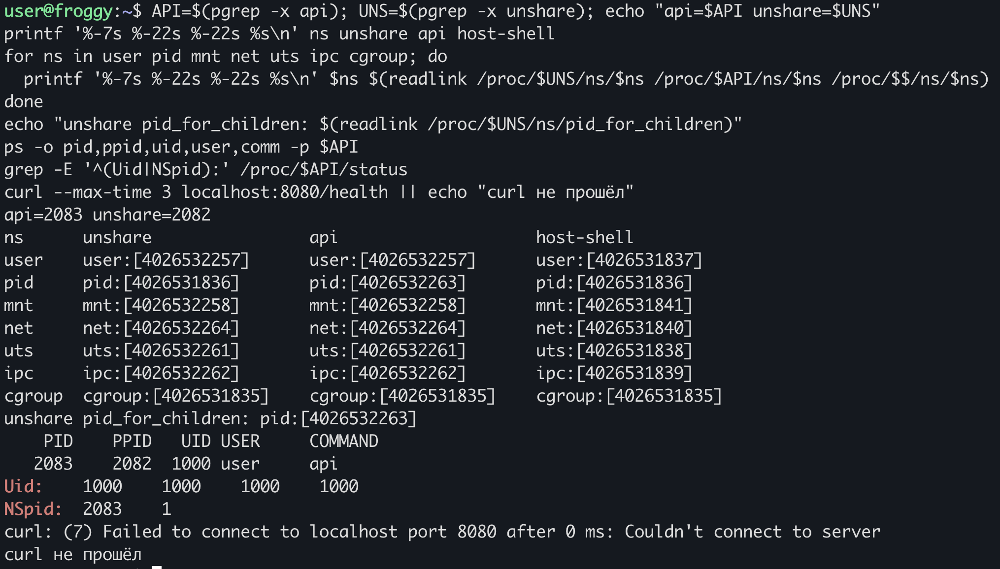

`NSpid: 2083 1` — вся часть в одной строке: один процесс, на хосте у него
PID 2083, в своём namespace — PID 1. Рядом `Uid: 1000`: снаружи «root» из
контейнера — обычный пользователь. `curl` не проходит, потому что сервис
слушает порт в другом сетевом стеке.

### Вид изнутри и ещё два сбоя

Входим в namespaces процесса через `nsenter`:

```bash
nsenter -t $API -U -p -m -n -u -i sh -c 'hostname; id; ps -o pid,ppid,comm'
```

```text
nsenter: setgroups failed: Operation not permitted
```

Причина: `unshare --map-root-user` перед записью `gid_map` пишет `deny` в
`/proc/<pid>/setgroups`. Без этого ядро не даёт непривилегированному
пользователю задать `gid_map` — иначе он мог бы сбросить группу, которая его
ограничивает. А `nsenter` по умолчанию вызывает `setgroups`. Решение — не
трогать группы, флаг `--preserve-credentials`:

```bash
nsenter --preserve-credentials -t $API -U -p -m -n -u -i sh -c 'echo "hostname: $(hostname)"; id; ps -o pid,ppid,comm; ip -br link; curl -s localhost:8080/health'
```

```text
hostname: mydocker
uid=0(root) gid=0(root) groups=0(root),65534(nogroup)
    PID    PPID COMMAND
      8       0 sh
     11       8 ps
lo               UNKNOWN        00:00:00:00:00:00 <LOOPBACK,UP,LOWER_UP>
ok
```

Вошли, но `api` как PID 1 в списке нет. Это не изоляция: `ps` без `-e`
показывает только процессы своего терминала, а `api` запущен с другого pts.
С `-e` (здесь `api` уже перезапущен, на хосте у него PID 2252):

```bash
nsenter --preserve-credentials -t $API -U -p -m -n -u -i sh -c 'echo "hostname: $(hostname)"; id; ps -eo pid,ppid,comm; ip -br link; curl -s localhost:8080/health'
```

```text
hostname: mydocker
uid=0(root) gid=0(root) groups=0(root),65534(nogroup)
    PID    PPID COMMAND
      1       0 api
      7       0 sh
     10       7 ps
lo               UNKNOWN        00:00:00:00:00:00 <LOOPBACK,UP,LOWER_UP>
ok
```

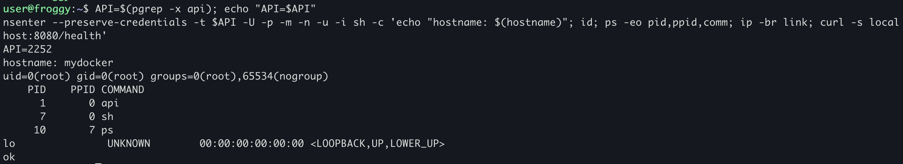

Изнутри `api` — PID 1, кроме вошедшего шелла больше никого. У `sh` PPID 0:
его родитель `nsenter` находится вне этого pid namespace, и изнутри у него
номера нет.

Наконец, `/info` — что процесс думает о себе сам:

```json
{ "pid": 1, "ppid": 0, "uid": 0, "hostname": "mydocker", "num_cpu": 2,
  "cgroup": "0::/user.slice/user-1000.slice/session-13.scope",
  "proc_status": { "NSpid": "1", "CapPrm": "000001ffffffffff",
                   "CapEff": "000001ffffffffff", "CapBnd": "000001ffffffffff" } }
```

`CapEff` стал полным, а в части 1 был нулевым. User namespace выдал своему
создателю все capabilities, но действуют они только внутри этого namespace.
Именно поэтому в части 4 будет что сбрасывать. `num_cpu` по-прежнему 2, а
путь cgroup — хостовый: потребление namespaces не трогают.

### Что изолировал каждый namespace

| Namespace | Что изолирует | Чем подтверждено |
|---|---|---|
| user | отображение uid/gid и владение capabilities; создаётся первым и позволяет uid 1000 создать остальные | `uid_map` = `0 1000 1`; внутри `uid=0`, на хосте `Uid: 1000`; `CapEff` полный внутри и нулевой снаружи |
| pid | номера процессов: свой PID 1, нельзя слать сигналы наружу | `NSpid: 2083 1`; `unshare` остался в старом pid namespace, его потомок попал в новый |
| mount | таблицу монтирований; именно свой `/proc` ослепляет `ps` | с `--mount-proc` видно 2 процесса, без него — 109 |
| net | весь сетевой стек: интерфейсы, маршруты, порты | внутри только `lo`; с хоста `curl` не проходит |
| uts | имя хоста | внутри `mydocker`, снаружи `froggy` |
| ipc | System V IPC и POSIX-очереди | очередь из `ipcmk -Q` есть внутри и отсутствует на хосте |

### Ловушки

- Ubuntu 24.04 запрещает непривилегированные user namespaces двумя
  независимыми механизмами, и ни одна ошибка не называет причину.
- `--pid` без `--fork` оставляет вызывающего вне созданного namespace.
- `nsenter -U` в namespace от `--map-root-user` падает на `setgroups`, нужен
  `--preserve-credentials`.
- `pgrep -f bin/api` находит и сам `unshare`: в его командной строке тоже есть
  эта строка. Искать нужно через `pgrep -x api`.
- `ps` без `-e` фильтрует по терминалу, и это легко принять за изоляцию.

---

## Часть 3. cgroups

Задача — завести для процесса cgroup v2, навесить лимиты на память, CPU и
число процессов и проверить каждый через сервис: поймать OOM, найти
throttling, остановить форк-бомбу.

### Своя cgroup

Делаем то же, что делает runc: создаём каталог в `/sys/fs/cgroup`, пишем
лимиты в файлы и кладём процесс в cgroup до запуска, чтобы все его потомки
рождались уже внутри.

Сначала проверяем, что контроллеры раздаются дочерним cgroup, и создаём свою:

```bash
CG=/sys/fs/cgroup/mydocker
cat /sys/fs/cgroup/cgroup.subtree_control
sudo mkdir $CG
ls $CG | grep -E '^(memory|cpu|pids)\.(max|current|stat|events)$'
```

```text
cpu memory pids
cpu.max
cpu.stat
memory.current
memory.events
memory.max
memory.stat
pids.current
pids.events
pids.max
```

Файлы контроллеров появились только потому, что `cpu`, `memory` и `pids`
включены в `cgroup.subtree_control` корня — в cgroup v2 контроллер выдаётся
детям явно. Ставим лимиты:

```bash
echo 100M           | sudo tee $CG/memory.max
echo 0              | sudo tee $CG/memory.swap.max
echo "50000 100000" | sudo tee $CG/cpu.max
```

`memory.swap.max = 0` нужен, чтобы при нехватке памяти процесс не уходил в
своп, а получал OOM. `pids.max` пока не трогаем: он считает и потоки, и
маленькое значение задушит рантайм Go раньше времени.

Создавать cgroup и переносить в неё процессы приходится через `sudo`: для
переноса нужны права на `cgroup.procs` общего предка исходной и целевой
cgroup, а здесь это корень иерархии. Docker в этом месте тоже root. Сам `api`
по-прежнему работает от uid 1000.

Переносим шелл первого терминала в cgroup и запускаем из него «контейнер»

```bash
echo $$ | sudo tee /sys/fs/cgroup/mydocker/cgroup.procs
cat /proc/self/cgroup
unshare --user --map-root-user --pid --fork --mount-proc --net --uts --ipc --kill-child \
  sh -c 'hostname mydocker; ip link set lo up; exec ./bin/api'
```

```text
2411
0::/mydocker
2026/10/01 17:50:55.720036 api starting: pid=1 ppid=0 uid=0 gid=0 host=mydocker cpus=2 addr=:8080
```

Сервис живёт в своём сетевом стеке, поэтому запросы к нему отправляем изнутри
его net namespace. Для этого во втором терминале заводим короткую функцию:

```bash
API=$(pgrep -x api); cat /proc/$API/cgroup
c() { nsenter --preserve-credentials -t $API -U -n curl -s "localhost:8080$1"; }
c /health
```

```text
0::/mydocker
ok
```

### Память: лимит 100 МБ и OOM

Просим сначала 50 МБ, потом ещё 100 — в сумме больше лимита:

```bash
cat $CG/memory.max $CG/memory.current
c '/eat?mb=50'; cat $CG/memory.current
c '/eat?mb=100'
cat $CG/memory.events
sudo dmesg | grep -iE 'oom|killed' | tail -5
```

```text
104857600
1986560
held 50 MB
55017472

low 0
high 0
max 24
oom 1
oom_kill 1
oom_group_kill 0
[ 5749.972107] api invoked oom-killer: gfp_mask=0xcc0(GFP_KERNEL), order=0, oom_score_adj=0
[ 5749.972357] oom-kill:constraint=CONSTRAINT_MEMCG,nodemask=(null),cpuset=/,mems_allowed=0,oom_memcg=/mydocker,task_memcg=/mydocker,task=api,pid=2535,uid=1000
[ 5749.972376] Memory cgroup out of memory: Killed process 2535 (api) total-vm:1398360kB, anon-rss:101248kB, file-rss:5120kB, shmem-rss:0kB, UID:1000 pgtables:308kB oom_score_adj:0
```

Второй запрос вернул пустой ответ: соединение оборвалось вместе с процессом.
Лог сервиса в первом терминале обрывается на середине:

```text
eat: asked for 50 MB (already holding 0 MB)
eat: +32 MB, now holding 32 MB
eat: +18 MB, now holding 50 MB
eat: asked for 100 MB (already holding 50 MB)
eat: +32 MB, now holding 82 MB
unshare: sigprocmask unblock failed: Invalid argument
```

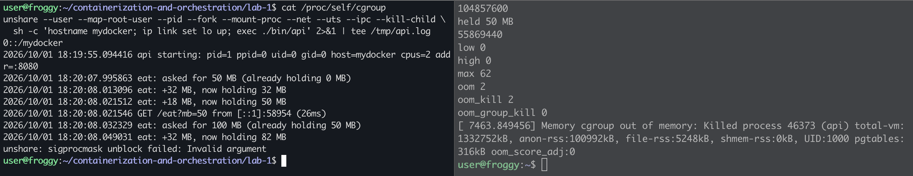
(переснял скрин с OOM)

Разбираем:

- `max 24` — cgroup 24 раза упиралась в `memory.max`, и ядро пыталось
  освободить память. Освобождать было нечего: анонимную память без свопа
  вытеснить некуда. Тогда `oom 1`, `oom_kill 1`.
- `CONSTRAINT_MEMCG`, `oom_memcg=/mydocker` — OOM не системный: на хосте
  свободно около 1.4 ГБ, убийство вызвано лимитом конкретной cgroup. Это тот
  же механизм, что `OOMKilled` в Kubernetes.
- `anon-rss:101248kB`, около 99 МБ — процесс убит на подходе к 100 МБ,
  следующий кусок по 32 МБ так и не дописался.
- В `dmesg` процесс записан как `pid=2535, uid=1000`. Ядро пишет хостовые
  номера: для него это обычный процесс пользователя 1000, а PID 1 и root
  существуют только изнутри.
- `unshare: sigprocmask unblock failed` — след `SIGKILL`. Когда ребёнка убили
  сигналом, `unshare --fork` пытается воспроизвести тот же сигнал на себе, а
  `SIGKILL` нельзя ни заблокировать, ни разблокировать, отсюда `EINVAL`.

### CPU: лимит пол-ядра и throttling

Перезапускаем сервис тем же `unshare` (шелл первого терминала всё ещё в
cgroup) и нагружаем одно ядро при квоте 0.5, потом добавляем второй поток:

```bash
API=$(pgrep -x api)
cat $CG/cpu.max; cat $CG/cpu.stat
c /burn; sleep 10; cat $CG/cpu.stat
top -b -n1 -p $API | tail -2
c '/burn?n=1'; sleep 10; cat $CG/cpu.stat
top -b -n1 -H -p $API | head -12
c /stop
c /info | grep num_cpu
```

```text
50000 100000
usage_usec 98856
nr_periods 26
nr_throttled 0
throttled_usec 0

burning on 1 core(s), GET /stop to stop
usage_usec 5130529
nr_periods 126
nr_throttled 99
throttled_usec 4983085
    PID USER      PR  NI    VIRT    RES    SHR S  %CPU  %MEM     TIME+ COMMAND
   2560 user      20   0 1266496   6164   5148 R  45.5   0.3   0:05.13 api

burning on 2 core(s), GET /stop to stop
usage_usec 10277839
nr_periods 229
nr_throttled 202
throttled_usec 20055527
    PID USER      PR  NI    VIRT    RES    SHR S  %CPU  %MEM     TIME+ COMMAND
   2560 user      20   0 1266496   6308   5264 R  20.0   0.3   0:07.68 api
   2565 user      20   0 1266496   6308   5264 R  20.0   0.3   0:02.56 api

stopped 2 burner(s)
  "num_cpu": 2,
```

| Прогон | Периодов | Из них throttled | CPU получено | throttled_usec |
|---|---|---|---|---|
| 1 поток, 10 с | 100 | 99 (99%) | 5.03 с | 4.98 с |
| 2 потока, 10 с | 103 | 103 (100%) | 5.15 с | 15.07 с |

`cpu.max = 50000 100000` — это 50 мс CPU на каждый период 100 мс. За 10 с
cgroup получила около 5 с CPU независимо от числа потоков: квота делится на
всех. Один поток выбирает 50 мс за первую половину периода и вторую половину
стоит, поэтому throttled почти каждый период. Два потока выбирают те же 50 мс
вдвоём примерно за 25 мс, каждый получает около четверти ядра (в `top` по
20%) и стоит дольше. `throttled_usec` считает простой по всем CPU, поэтому во
втором прогоне он больше прошедшего времени: 15 с за 10 с на двух ядрах.

`num_cpu` при этом всё ещё 2: квота не меняет маску affinity, и рантайм,
который считает ядра через `sched_getaffinity`, видит весь хост.

**Сбой при пересъёмке скриншота.** Когда я переснимал этот шаг, `cpu.stat`
показал ноль throttled-периодов и 100% CPU в `top`. Причина нашлась в первой
же строке: `cpu.max` оказался `max 100000` — лимит был перезаписан. Лимит
cgroup — это просто содержимое файла: кто может писать в cgroup, тот снимает
его молча, и процесс внутри об этом не узнаёт. После
`echo "50000 100000" | sudo tee $CG/cpu.max` прогон повторён:

```bash
cat $CG/cpu.max
grep -E 'usage_usec|nr_|throttled' $CG/cpu.stat
c /burn; sleep 10
grep -E 'usage_usec|nr_|throttled' $CG/cpu.stat
top -b -n1 -p $API | tail -2
c /stop
```

```text
50000 100000
usage_usec 190045453
nr_periods 5
nr_throttled 0
throttled_usec 0
nr_bursts 0
burning on 1 core(s), GET /stop to stop
usage_usec 196963270
nr_periods 143
nr_throttled 137
throttled_usec 7103089
nr_bursts 0
    PID USER      PR  NI    VIRT    RES    SHR S  %CPU  %MEM     TIME+ COMMAND
 109765 user      20   0 1266496   6108   5196 R  50.0   0.3   0:15.57 api
stopped 1 burner(s)
```

137 throttled из 138 периодов и ровно 50.0% в `top`.

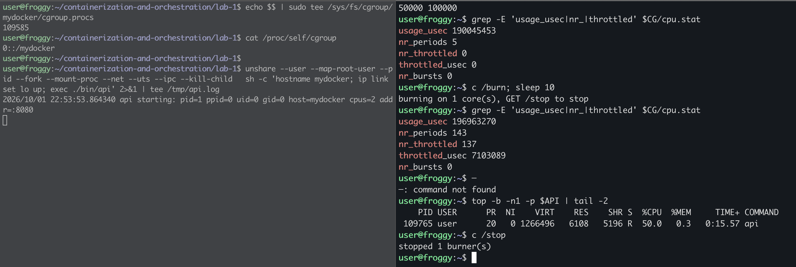

### pids: форк-бомба

До бомбы смотрим, сколько задач уже в cgroup:

```bash
cat $CG/pids.current
```

```text
8
```

Восемь задач: шелл первого терминала, `unshare` и 6 потоков `api`. Значит,
`pids.max` считает потоки, а не только процессы.

Ставим лимит 30 и запускаем `stress-ng` в ту же cgroup. Новый шелл переносит
себя в `mydocker` и через `exec` становится `stress-ng`, так что все его форки
рождаются внутри:

```bash
sudo apt install -y stress-ng
echo 30 | sudo tee $CG/pids.max
sh -c 'echo $$ | sudo tee /sys/fs/cgroup/mydocker/cgroup.procs >/dev/null; exec stress-ng --fork 8 --timeout 15s --metrics-brief' &
sleep 5; cat $CG/pids.current $CG/pids.max $CG/pids.events
c /health
wait
cat $CG/pids.events
```

```text
24
30
max 0
ok
stress-ng: metrc: [3200] fork              11065     15.01      2.66      4.87       736.95        1469.89
max 0
```

**Первая попытка в лимит не упёрлась**: `max 0`. `--fork 8` — это 8 воркеров,
каждый держит одного ребёнка, который сразу завершается. Одновременно живёт
около 24 задач, меньше лимита. Это поток форков, а не бомба. Нужно, чтобы
каждый воркер держал много детей одновременно — флаг `--fork-max`:

```bash
sh -c 'echo $$ | sudo tee /sys/fs/cgroup/mydocker/cgroup.procs >/dev/null; exec stress-ng --fork 4 --fork-max 100 --timeout 15s --metrics-brief' &
sleep 5; cat $CG/pids.current $CG/pids.max $CG/pids.events
c /health
```

```text
30
30
max 4788
nsenter: cannot open /proc/2560/ns/user: No such file or directory
```

Лимит сработал, но `api` по старому PID не нашёлся. **Второй сбой**:
оказалось, что первый терминал переподключался, и `api` был перезапущен из
нового ssh-шелла. Перенос `echo $$ > cgroup.procs` действует на конкретный
процесс, а не на «терминал», поэтому новый шелл родился в своей сессионной
cgroup — и `api` вместе с ним:

```bash
pgrep -x api; cat $CG/pids.current
```

```text
14377
0
```

`pids.current = 0` после прогона: в `mydocker` никого, `stress-ng` упирался в
лимит один. Переносим шелл заново, перезапускаем `api` и повторяем:

```bash
cat /proc/self/cgroup
echo $$ | sudo tee /sys/fs/cgroup/mydocker/cgroup.procs
cat /proc/self/cgroup
```

```text
0::/user.slice/user-1000.slice/session-27.scope
14362
0::/mydocker
```

```bash
API=$(pgrep -x api); echo "API=$API"; cat /proc/$API/cgroup; cat $CG/pids.current
c /health
sh -c 'echo $$ | sudo tee /sys/fs/cgroup/mydocker/cgroup.procs >/dev/null; exec stress-ng --fork 4 --fork-max 100 --timeout 15s --metrics-brief' &
sleep 5; cat $CG/pids.current $CG/pids.events
c /health; echo "health exit=$?"
c '/burn?n=4'; echo "burn exit=$?"
wait
c /stop
```

```text
API=30228
0::/mydocker
6
ok
stress-ng: info:  [30238] dispatching hogs: 4 fork
29
max 19232
ok
health exit=0
burning on 4 core(s), GET /stop to stop
burn exit=0
stress-ng: metrc: [30238] fork               1291     15.00      0.36      7.15        86.06         171.88
stress-ng: info:  [30238] successful run completed in 15.01 secs
nsenter: cannot open /proc/30228/ns/user: No such file or directory
```

На этот раз `api` упал по-настоящему. Лог в первом терминале:

```text
burn: started 4 burner(s), 4 running
GET /burn?n=4 from [::1]:37054 (0s)
runtime: failed to create new OS thread (have 6 already; errno=11)
runtime: may need to increase max user processes (ulimit -u)
fatal error: newosproc

goroutine 9 gp=0x3670e3407c20 m=0 mp=0xbf73c0 [running]:
runtime.throw(...)
runtime.newosproc(...)                /usr/local/go/src/runtime/os_linux.go:199
runtime.startTemplateThread()         /usr/local/go/src/runtime/proc.go:2962
runtime.LockOSThread()                /usr/local/go/src/runtime/proc.go:5679
main.spin(...)                        lab-1/api/main.go:129
```

И причина в ядре:

```bash
sudo dmesg | grep 'pids controller' | tail -1
```

```text
cgroup: fork rejected by pids controller in /mydocker
```

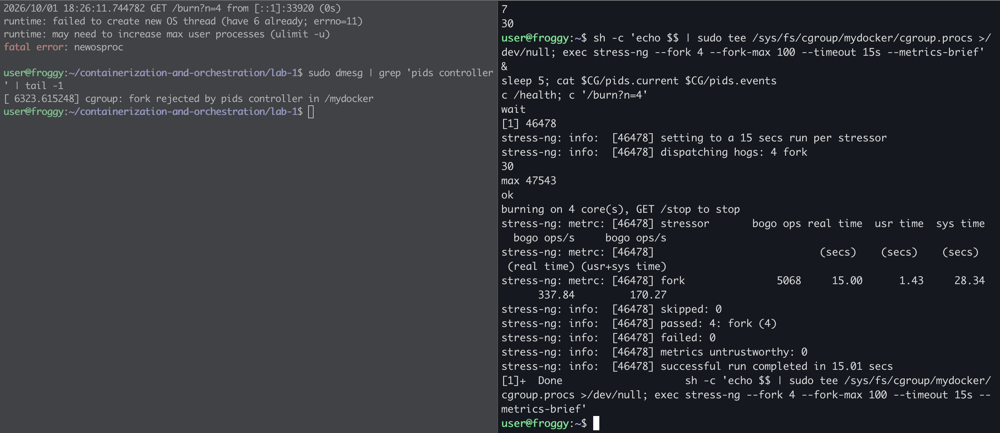

Разбираем:

- Бомба осталась внутри: `pids.current` держится у 29–30 при лимите 30,
  отказов в `fork` — `max 19232`. Пропускная способность `stress-ng` упала с
  11065 до 1291 форков за 15 с.
- `/health` продолжал отвечать: ему хватало уже созданных потоков.
- `/burn?n=4` вернул 200, но бёрнер вызывает `runtime.LockOSThread()`, рантайму
  Go понадобился новый поток ОС, `clone` получил `EAGAIN` (`errno=11`) от
  pids-контроллера, и Go в этой ситуации завершает весь процесс.
- Подсказка рантайма про `ulimit -u` — ложный след. Причину называет только
  `dmesg`.

### Итог по лимитам

| Контроллер | Лимит | Чем ударили | Что сделало ядро |
|---|---|---|---|
| memory | `memory.max = 100M`, `memory.swap.max = 0` | `/eat?mb=50`, затем `/eat?mb=100` | reclaim не помог (`max 24`), OOM kill внутри cgroup на ~99 МБ |
| cpu | `cpu.max = 50000 100000` | `/burn`, затем второй поток | около 5 с CPU за 10 с при любом числе потоков, throttled 99–100% периодов |
| pids | `pids.max = 30` | `stress-ng --fork 4 --fork-max 100` | `fork`/`clone` получают `EAGAIN`; заодно упал сосед по cgroup — `api` |

---

## Часть 4. Права

Namespaces прячут, cgroups ограничивают объём, но процесс внутри
по-прежнему root с полным `CapEff` и может делать любые системные вызовы.
Задача — оставить ему только нужный минимум двумя независимыми механизмами:
capabilities (какие привилегированные операции разрешит ядро) и seccomp
(какие системные вызовы вообще можно сделать).

### Capabilities

Как выяснилось в части 1, демонстрация имеет смысл, только если право у
процесса было, а после сброса исчезло. Поэтому берём root в своём user
namespace и действия над ресурсами, которыми этот namespace владеет:

| Действие | Нужна capability | Ресурс принадлежит |
|---|---|---|
| `bind` на порт 80 | `CAP_NET_BIND_SERVICE` (бит 10) | свой net namespace |
| `hostname` | `CAP_SYS_ADMIN` (бит 21) | свой uts namespace |

Сбрасываем через `setpriv --bounding-set`. У uid 0 при `execve` новый набор
прав собирается из bounding set, поэтому убранного из потолка бита после
`exec` нет ни в `CapPrm`, ни в `CapEff`, и вернуть его нельзя.

**Прогон A** — root в userns с полным набором, контрольный:

```bash
unshare --user --map-root-user --net --uts sh -c '
  ip link set lo up
  grep -E "^Cap(Eff|Bnd)" /proc/self/status
  hostname test && echo "hostname: ok"
  ADDR=127.0.0.1:80 timeout 2 ./bin/api'
```

```text
CapEff:    000001ffffffffff
CapBnd:    000001ffffffffff
hostname: ok
2026/10/01 23:14:33.414870 api starting: pid=110561 ppid=110560 uid=0 gid=0 host=test cpus=2 addr=127.0.0.1:80
```

Имя хоста меняется, порт 80 занимается.

**Прогон B** — то же самое, но без `net_bind_service` и `sys_admin`:

```bash
unshare --user --map-root-user --net --uts sh -c '
  ip link set lo up
  exec setpriv --bounding-set -net_bind_service,-sys_admin sh -c "
    grep -E \"^Cap(Eff|Bnd)\" /proc/self/status
    capsh --decode=\$(awk \"/^CapEff/{print \\\$2}\" /proc/self/status) | tr , \"\\n\" | grep -cE \"cap_\" | sed \"s/^/caps в CapEff: /\"
    hostname test || echo \"hostname: denied\"
    ADDR=127.0.0.1:80 timeout 2 ./bin/api"'
```

```text
CapEff:    000001ffffdffbff
CapBnd:    000001ffffdffbff
caps в CapEff: 39
hostname: you must be root to change the host name
hostname: denied
2026/10/01 23:14:49.646553 api starting: pid=110579 ppid=110578 uid=0 gid=0 host=froggy cpus=2 addr=127.0.0.1:80
2026/10/01 23:14:49.646910 listen tcp 127.0.0.1:80: bind: permission denied
```

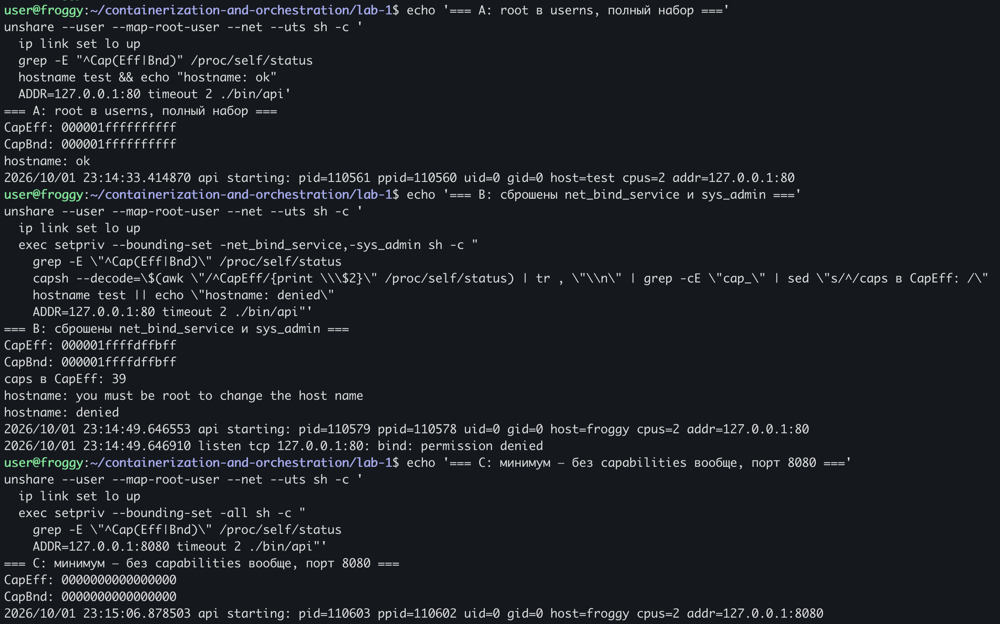

`ffffdffbff` против `ffffffffff`: сняты ровно два бита, `0x400` (бит 10) и
`0x200000` (бит 21), осталось 39 из 41. uid по-прежнему 0, а действия не
проходят: ядро смотрит на бит в `CapEff`, а не на uid. Сообщение `hostname`
«you must be root» вводит в заблуждение: утилита додумывает причину по старой
модели «root может всё», а root здесь как раз есть.

**Прогон C** — минимум, без единой capability, на непривилегированном порту:

```bash
unshare --user --map-root-user --net --uts sh -c '
  ip link set lo up
  exec setpriv --bounding-set -all sh -c "
    grep -E \"^Cap(Eff|Bnd)\" /proc/self/status
    ADDR=127.0.0.1:8080 timeout 2 ./bin/api"'
```

```text
CapEff:    0000000000000000
CapBnd:    0000000000000000
2026/10/01 23:15:06.878503 api starting: pid=110603 ppid=110602 uid=0 gid=0 host=froggy cpus=2 addr=127.0.0.1:8080
```

Сервис работает без единой capability — это и есть нужный минимум: `api` не
требует привилегий вообще.

Обратите внимание на порядок: `ip link set lo up` выполнен до `setpriv`,
потому что ему нужен `CAP_NET_ADMIN`. Runtime'ы делают так же: окружение
настраивают с полными правами, а урезают их прямо перед `exec` процесса
контейнера.

### Seccomp

Capabilities отвечают на вопрос «разрешит ли ядро root эту привилегированную
операцию». Seccomp работает раньше и грубее: это BPF-фильтр на входе в
системный вызов. Он смотрит на номер вызова и аргументы до того, как
выполнится код вызова и любая проверка прав, поэтому режет вызов даже при
полном `CapEff`.

Профиль — [`seccomp/profile.json`](seccomp/profile.json). Это denylist: по
умолчанию разрешено всё, а запрещены группы вызовов, которые перестраивают
изоляцию, трогают общие с хостом ресурсы или само ядро:

| Группа | Вызовы | Ответ |
|---|---|---|
| выход из изоляции | `unshare`, `setns`, `mount`, `umount2`, `pivot_root` | `EPERM` |
| новый mount API | `fsopen`, `fsconfig`, `fsmount`, `fspick`, `move_mount`, `open_tree`, `mount_setattr` | `EPERM` |
| `clone3` | `clone3` | `ENOSYS` |
| имя хоста | `sethostname`, `setdomainname` | `EPERM` |
| системные часы | `settimeofday`, `clock_settime`, `clock_adjtime`, `adjtimex` | `EPERM` |
| ядро | `init_module`, `finit_module`, `delete_module`, `kexec_load`, `kexec_file_load`, `reboot` | `EPERM` |
| чужая память | `ptrace`, `process_vm_readv`, `process_vm_writev` | `EPERM` |
| поверхность атаки | `bpf`, `perf_event_open`, `userfaultfd`, `keyctl`, `add_key`, `request_key` | `EPERM` |

Загрузчик — [`seccomp/seccomp-exec.py`](seccomp/seccomp-exec.py): читает JSON,
через libseccomp собирает фильтр, загружает его и делает `exec` команды.
Фильтр переживает `execve` и наследуется всеми потомками.

```bash
sudo apt install -y python3-seccomp
```

**Прогон D** — постановка как в A, root в userns с полным набором
capabilities, но под фильтром:

```bash
unshare --user --map-root-user --net --uts sh -c '
  ip link set lo up
  exec ./seccomp/seccomp-exec.py seccomp/profile.json sh -c "
    grep -E \"^(CapEff|NoNewPrivs|Seccomp|Seccomp_filters)\" /proc/self/status
    hostname test && echo \"hostname: ok\" || echo \"hostname: denied by seccomp\"
    unshare --user true && echo \"unshare: ok\" || echo \"unshare: denied by seccomp\"
    date -s 2030-01-01 >/dev/null || echo \"date: denied\"
    ADDR=127.0.0.1:80 timeout 2 ./bin/api"'
```

```text
CapEff:    000001ffffffffff
NoNewPrivs:    1
Seccomp:    2
Seccomp_filters:    1
hostname: you must be root to change the host name
hostname: denied by seccomp
unshare: unshare failed: Operation not permitted
unshare: denied by seccomp
date: cannot set date: Operation not permitted
date: denied
2026/10/01 23:21:49.757995 api starting: pid=110783 ppid=110782 uid=0 gid=0 host=froggy cpus=2 addr=127.0.0.1:80
```

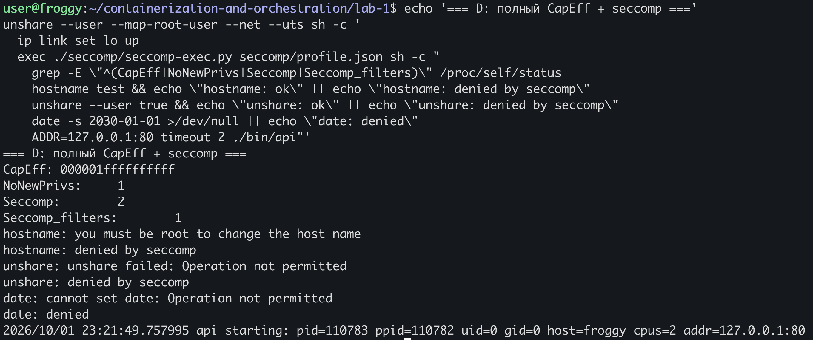

`CapEff` тот же полный, что в A, но `Seccomp: 2` (режим filter) и
`NoNewPrivs: 1`. `hostname`, который в A проходил, теперь отклонён: при тех
же правах отказал фильтр. При этом `api` занял порт 80 — `bind` профиль не
трогает, а `CAP_NET_BIND_SERVICE` у процесса есть. Механизмы независимы и
закрывают каждый своё.

Строка `date: denied` ничего не доказывает: системные часы не принадлежат
этому user namespace, и `date -s` не прошёл бы и без фильтра.

### Выводы

**Что закрывает каждый механизм.**

| Механизм | На какой вопрос отвечает | Что закрывает | Чего не закрывает |
|---|---|---|---|
| capabilities | разрешит ли ядро root эту привилегированную операцию | root внутри не может менять сеть, монтировать, грузить модули, трассировать чужие процессы — кроме того, что оставлено в наборе | непривилегированные вызовы: вся поверхность ядра, доступная обычному процессу |
| seccomp | можно ли вообще сделать этот системный вызов | опасный или ненужный вызов отклоняется на входе, до кода ядра и проверки прав, даже у root с полным `CapEff` | только перечисленное (в denylist) и только по номеру и числовым аргументам — указатели BPF не разыменовывает |
| `no_new_privs` | может ли `execve` дать больше прав | setuid-бит и file capabilities игнорируются; обязателен для непривилегированного seccomp | не отнимает уже имеющихся прав |

---

## Часть 5. Свой Docker: `mydocker.sh` против `docker run`

Задача — собрать части 2–4 в один скрипт, проверить, что сервис через него
поднимается и `/health` отвечает, а потом поставить рядом настоящий
`docker run` и сравнить.

### Как устроен скрипт

[`mydocker.sh`](mydocker.sh) запускается от обычного пользователя, `sudo`
нужен только для cgroup. По шагам:

1. Создаёт свою cgroup на каждый запуск, `/sys/fs/cgroup/mydocker-<pid>`, и
   пишет `memory.max`, `memory.swap.max = 0`, `cpu.max`, `pids.max`. Общей
   cgroup не бывает никогда — это урок из прогона со `stress-ng`.
2. Подоболочка переносит себя в cgroup, проверяет, что перенос удался, и
   через `exec` становится контейнером, так что все потомки рождаются внутри.
   Сам скрипт остаётся снаружи, ждёт и по `trap ... EXIT` удаляет опустевшую
   cgroup.
3. `unshare` создаёт user, pid (с `--fork` и `--mount-proc`), mount, net, uts,
   ipc и cgroup namespace. Последний создаётся после переноса, и контейнер
   видит свою cgroup как `/`.
4. Внутри сначала делается то, что требует прав (`hostname`,
   `ip link set lo up`), потом права отбираются прямо перед `exec`:
   `setpriv --bounding-set -all --no-new-privs`, затем `seccomp-exec.py` с
   профилем, который делает `exec` сервиса.

### Первый запуск: `No such process`

```bash
./mydocker.sh
```

```text
mydocker: cgroup /sys/fs/cgroup/mydocker-111242 memory.max=100M cpu.max="50000 100000" pids.max=64
tee: /sys/fs/cgroup/mydocker-111242/cgroup.procs: No such process
```

В первой версии перенос был написан как `echo "$BASHPID" | sudo tee .../cgroup.procs`.
В bash каждая сторона пайпа выполняется в своей подоболочке, поэтому
`$BASHPID` раскрылся в PID короткоживущего `echo`. Пока `tee` писал этот PID,
процесс уже завершился, и ядро ответило `ESRCH`. При этом `trap` отработал:
cgroup удалилась.

### Второй запуск: работает, но без лимитов

Вторая версия: `sudo tee .../cgroup.procs <<<"$BASHPID"`. Ошибки нет, сервис
поднялся, `/health` ответил. Но снаружи видно другое:

```bash
API=$(pgrep -x api)
cat /proc/$API/cgroup
ls -d /sys/fs/cgroup/mydocker-*
nsenter --preserve-credentials -t $API -U -n curl -s localhost:8080/info | grep cgroup
```

```text
0::/user.slice/user-1000.slice/session-77.scope
/sys/fs/cgroup/mydocker-111298
  "cgroup": "0::/",
```

`api` оказался в сессионной cgroup ssh, а лимиты висели на пустой
`mydocker-111298`: сервис работал без ограничений. Причина: перенаправления
внешней команды bash раскрывает уже после `fork`, в дочернем процессе, и
`$BASHPID` получил PID того процесса, который тут же стал `sudo`. В cgroup
переехал сам `sudo`.

Самое неприятное — изнутри это не видно. cgroup namespace делает корнем ту
cgroup, где процесс оказался, и `/info` честно показывает `0::/` при любом
раскладе. Ошибки нет, выглядит как успех.

Исправление — присвоить PID переменной (присваивание выполняется прямо в
подоболочке) и после переноса проверить результат:

```bash
me=$BASHPID
echo "$me" | sudo tee "$CG/cgroup.procs" >/dev/null
[ "$(cat /proc/self/cgroup)" = "0::/${CG#/sys/fs/cgroup/}" ] ||
  { echo "mydocker: not in $CG: $(cat /proc/self/cgroup)" >&2; exit 1; }
```

Если перенос не удался, скрипт падает, а не запускает контейнер без лимитов.

### Третий запуск: всё на месте

```bash
./mydocker.sh
```

```text
mydocker: cgroup /sys/fs/cgroup/mydocker-111420 memory.max=100M cpu.max="50000 100000" pids.max=64
2026/10/01 23:50:03.415717 api starting: pid=1 ppid=0 uid=0 gid=0 host=mydocker cpus=2 addr=:8080
```

Снаружи:

```bash
API=$(pgrep -x api); echo "API=$API"
ps -o pid,ppid,uid,user,comm -p $API
grep -E '^(Uid|NSpid|CapEff|CapBnd|NoNewPrivs|Seccomp):' /proc/$API/status
cat /proc/$API/cgroup
nsenter --preserve-credentials -t $API -U -n curl -s localhost:8080/health
```

```text
API=111449
    PID    PPID   UID USER     COMMAND
 111449  111443  1000 user     api
Uid:    1000    1000    1000    1000
NSpid:    111449    1
CapEff:    0000000000000000
CapBnd:    0000000000000000
NoNewPrivs:    1
Seccomp:    2
0::/mydocker-111420
ok
```

Изнутри, `/info`:

```json
{ "pid": 1, "ppid": 0, "uid": 0, "hostname": "mydocker", "num_cpu": 2,
  "cgroup": "0::/",
  "proc_status": { "NSpid": "1", "CapEff": "0000000000000000", "CapBnd": "0000000000000000",
                   "NoNewPrivs": "1", "Seccomp": "2", "Seccomp_filters": "1", "Threads": "5" } }
```

После Ctrl-C cgroup удаляется:

```bash
ls -d /sys/fs/cgroup/mydocker-*
```

```text
ls: cannot access '/sys/fs/cgroup/mydocker-*': No such file or directory
```

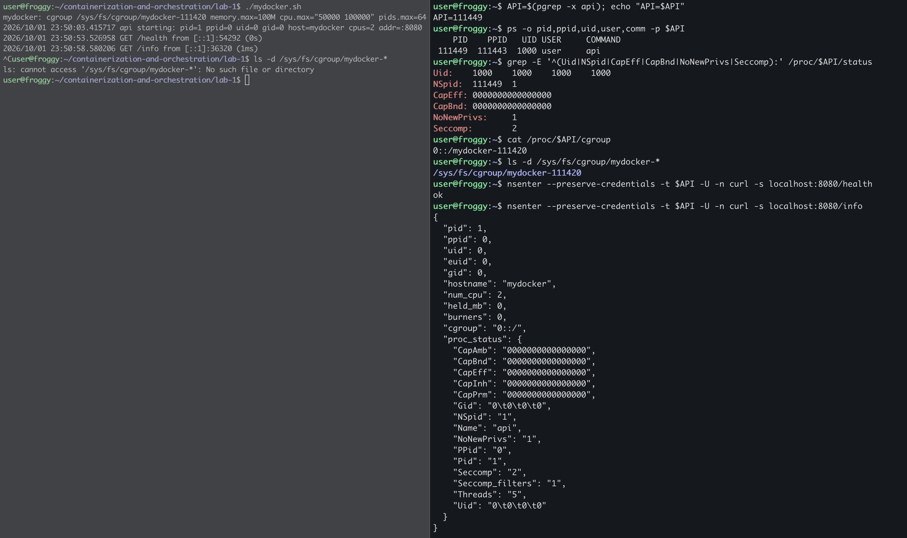

Все механизмы частей 2–4 на месте: снаружи uid 1000, своя cgroup с лимитами,
ноль capabilities, `no_new_privs`, seccomp; изнутри PID 1, root, свой hostname.

### Тот же сервис через `docker run`

Ставим рядом настоящий Docker с теми же лимитами и смотрим на него теми же
инструментами. Образа ещё нет (это часть 6), поэтому статический бинарник
монтируем в `busybox`:

```bash
sudo docker run -d --name api -p 127.0.0.1:8080:8080 -v "$PWD/bin/api:/api:ro" \
  --memory 100m --memory-swap 100m --cpus 0.5 --pids-limit 64 --hostname mydocker \
  busybox /api
D=$(sudo docker inspect -f '{{.State.Pid}}' api); echo "D=$D"
```

Процесс и его родитель:

```bash
ps -o pid,ppid,uid,user,comm -p $D
ps -o pid,comm -p $(ps -o ppid= -p $D)
```

```text
    PID    PPID   UID USER     COMMAND
 112543  112520     0 root     api
    PID COMMAND
 112520 containerd-shim
```

Права:

```bash
sudo grep -E '^(Uid|NSpid|CapEff|CapBnd|NoNewPrivs|Seccomp|Seccomp_filters):' /proc/$D/status
capsh --decode=$(sudo awk '/^CapEff/{print $2}' /proc/$D/status)
sudo cat /proc/$D/attr/current
```

```text
Uid:    0    0    0    0
NSpid:    112543    1
CapEff:    00000000a80425fb
CapBnd:    00000000a80425fb
NoNewPrivs:    0
Seccomp:    2
Seccomp_filters:    1
0x00000000a80425fb=cap_chown,cap_dac_override,cap_fowner,cap_fsetid,cap_kill,cap_setgid,cap_setuid,cap_setpcap,cap_net_bind_service,cap_net_raw,cap_sys_chroot,cap_mknod,cap_audit_write,cap_setfcap
docker-default (enforce)
```

cgroup и лимиты:

```bash
cat /proc/$D/cgroup
CGD=/sys/fs/cgroup$(cut -d: -f3 /proc/$D/cgroup)
cat $CGD/memory.max $CGD/cpu.max $CGD/pids.max
```

```text
0::/system.slice/docker-a6184454ecbda26d2111b85423d4275530f4f72fccf9845bd9923affc37d08c4.scope
104857600
50000 100000
64
```

Namespaces контейнера против хоста:

```bash
for ns in user pid mnt net uts ipc cgroup; do
  printf '%-7s %-22s %s\n' $ns $(sudo readlink /proc/$D/ns/$ns /proc/$$/ns/$ns)
done
```

```text
user    user:[4026531837]      user:[4026531837]
pid     pid:[4026532263]       pid:[4026531836]
mnt     mnt:[4026532258]       mnt:[4026531841]
net     net:[4026532265]       net:[4026531840]
uts     uts:[4026532261]       uts:[4026531838]
ipc     ipc:[4026532262]       ipc:[4026531839]
cgroup  cgroup:[4026532264]    cgroup:[4026531835]
```

`user` у контейнера тот же, что у хоста. Ещё деталь: inode новых namespaces
(`4026532258`, `4026532263` и т.д.) совпали с теми, что получал `unshare` в
части 2. Номера освобождаются вместе с namespace и переиспользуются, так что
inode — идентификатор только среди живых namespaces.

Сеть:

```bash
curl -s localhost:8080/health
ip -br link | grep -E 'docker0|veth'
sudo iptables -t nat -S DOCKER | grep 8080
```

```text
ok
docker0          UP             d6:0e:fb:ae:5a:ee <BROADCAST,MULTICAST,UP,LOWER_UP>
veth3731474@if2  UP             4e:8a:b1:96:d2:71 <BROADCAST,MULTICAST,UP,LOWER_UP>
-A DOCKER -d 127.0.0.1/32 ! -i docker0 -p tcp -m tcp --dport 8080 -j DNAT --to-destination 172.17.0.2:8080
```

Файловая система:

```bash
sudo findmnt -N $D -o TARGET,SOURCE,FSTYPE | head -12
```

```text
TARGET                  SOURCE                  FSTYPE
/                       overlay                 overlay
├─/proc                 proc                    proc
│ ├─/proc/bus           proc[/bus]              proc
│ ├─/proc/fs            proc[/fs]               proc
│ ├─/proc/irq           proc[/irq]              proc
│ ├─/proc/sys           proc[/sys]              proc
│ ├─/proc/sysrq-trigger proc[/sysrq-trigger]    proc
│ ├─/proc/acpi          tmpfs                   tmpfs
│ ├─/proc/interrupts    tmpfs[/null]            tmpfs
│ ├─/proc/kcore         tmpfs[/null]            tmpfs
│ ├─/proc/keys          tmpfs[/null]            tmpfs
```

### Сравнение

| | `mydocker.sh` | `docker run` по умолчанию |
|---|---|---|
| pid, mount, net, uts, ipc, cgroup namespaces | есть | есть |
| user namespace | есть: root внутри — uid 1000 снаружи | нет: общий с хостом, root внутри — root на хосте (`Uid: 0`) |
| cgroup-лимиты | те же файлы, те же значения | `104857600`, `50000 100000`, `64` |
| где cgroup | `/mydocker-<pid>`, создаётся руками | `/system.slice/docker-<id>.scope`, через systemd |
| capabilities | ни одной | 14 (`a80425fb`): `chown`, `dac_override`, `setuid`, `setgid`, `net_raw`, `mknod` и др. |
| `no_new_privs` | `1` | `0`, включается `--security-opt no-new-privileges` |
| seccomp | denylist, около 40 вызовов, без фильтра по аргументам | allowlist, фильтр аргументов `clone`, `clone3 → ENOSYS` |
| LSM | нет | AppArmor `docker-default` |
| корневая ФС | хостовая целиком, перемонтирован только `/proc` | `overlay` из слоёв образа и `pivot_root` |
| маскирование `/proc` | нет | `kcore`, `keys`, `interrupts` закрыты `/dev/null`; `sys`, `bus`, `irq`, `sysrq-trigger` только для чтения |
| сеть | только `lo`, снаружи не достучаться | veth-пара, мост `docker0`, DNAT `127.0.0.1:8080 → 172.17.0.2:8080` |
| родитель процесса | `unshare` в терминале пользователя | `containerd-shim` |
| запуск | от обычного пользователя, `sudo` только для cgroup | через root-демон `dockerd`/`containerd` |

---

## Часть 6. Образы

Самого большого пробела `mydocker.sh` — своей файловой системы — не было
видно, потому что статическому бинарнику от хоста ничего не нужно. Образ —
это и есть эта ФС: стопка read-only слоёв, которую overlayfs собирает в
корень контейнера, плюс тонкий записываемый слой сверху. Задача — собрать
образ двумя способами, сравнить размер, слои и кэш, и посмотреть, куда
пропадают записанные в контейнер файлы.

Файлы:

- [`Dockerfile.single`](Dockerfile.single) — сборка и запуск в одном
  `golang:1.27`;
- [`Dockerfile`](Dockerfile) — multi-stage: стадия `build` на `golang:1.27`,
  финальный образ `FROM scratch` с одним бинарником;
- [`.dockerignore`](.dockerignore) — в контекст сборки попадает только `api/`.

### Размер и слои

Собираем оба образа:

```bash
sudo docker build -f Dockerfile.single -t api:single .
sudo docker build -t api:multi .
```

Первая сборка тянет `golang:1.27` (несколько слоёв общим весом около 300 МБ
в сжатом виде) и занимает 70 с. Во второй видно интересное:

```text
 => CACHED [build 2/6] WORKDIR /src                                    0.0s
 => [build 3/6] COPY api/go.mod ./                                     0.0s
 => [build 4/6] RUN go mod download                                    0.4s
```

`WORKDIR /src` взят из кэша первой сборки: база и инструкция те же, что в
`Dockerfile.single`. Кэш BuildKit общий для всех Dockerfile на машине, его
ключ — родительский слой и инструкция, а не имя файла.

Сравниваем:

```bash
sudo docker images api
for t in single multi; do echo "api:$t — слоёв: $(sudo docker image inspect -f '{{len .RootFS.Layers}}' api:$t)"; done
sudo docker history api:multi
sudo docker history api:single | head -8
```

```text
IMAGE        ID             DISK USAGE   CONTENT SIZE
api:multi    13bf4af3b247       11.7MB         3.33MB
api:single   17e617c36021       1.44GB          344MB

api:single — слоёв: 10
api:multi — слоёв: 1

IMAGE          CREATED          CREATED BY                      SIZE      COMMENT
13bf4af3b247   34 seconds ago   ENTRYPOINT ["/api"]             0B        buildkit.dockerfile.v0
<missing>      34 seconds ago   EXPOSE [8080/tcp]               0B        buildkit.dockerfile.v0
<missing>      34 seconds ago   USER 65534:65534                0B        buildkit.dockerfile.v0
<missing>      34 seconds ago   COPY /out/api /api # buildkit   8.34MB    buildkit.dockerfile.v0

IMAGE          CREATED              CREATED BY                                      SIZE      COMMENT
17e617c36021   About a minute ago   ENTRYPOINT ["/usr/local/bin/api"]               0B        buildkit.dockerfile.v0
<missing>      About a minute ago   EXPOSE [8080/tcp]                               0B        buildkit.dockerfile.v0
<missing>      About a minute ago   RUN /bin/sh -c CGO_ENABLED=0 go build -trimp…   109MB     buildkit.dockerfile.v0
<missing>      About a minute ago   COPY api/ ./ # buildkit                         1.65MB    buildkit.dockerfile.v0
<missing>      About a minute ago   WORKDIR /src                                    8.19kB    buildkit.dockerfile.v0
<missing>      12 days ago          WORKDIR /go                                     4.1kB     buildkit.dockerfile.v0
<missing>      12 days ago          RUN /bin/sh -c mkdir -p "$GOPATH/src" "$GOPA…   16.4kB    buildkit.dockerfile.v0
```

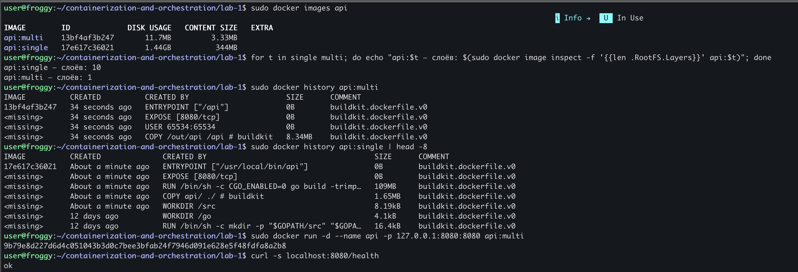

| Образ | База | Размер на диске | Сжатый | Слоёв |
|---|---|---|---|---|
| `api:single` | `golang:1.27` (Debian и тулчейн Go) | 1.44 GB | 344 MB | 10 |
| `api:multi` | `scratch` | 11.7 MB | 3.33 MB | 1 |

Разница — примерно в 120 раз. Из 1.44 GB сервису нужны 8 МБ бинарника, всё
остальное — Debian, компилятор, стандартная библиотека в исходниках и слой
`go build` на 109 МБ, хотя сам бинарник весит 8 МБ (разбор в выводах). В
multi-stage единственный слой — `COPY --from=build`: `scratch` пустой, а
`USER`, `EXPOSE`, `ENTRYPOINT` — только метаданные, 0 байт.

Проверяем, что сервис из `scratch` работает и не от root:

```bash
sudo docker run -d --name api -p 127.0.0.1:8080:8080 api:multi
curl -s localhost:8080/health
D=$(sudo docker inspect -f '{{.State.Pid}}' api); sudo grep -E '^Uid' /proc/$D/status
sudo docker rm -f api
```

```text
ok
Uid:    65534    65534    65534    65534
```

### Кэш при повторной сборке

Пересобираем без изменений, потом меняем одну строку кода:

```bash
sudo docker build --progress=plain -t api:multi . 2>&1 | grep -E '^#[0-9]+ \[|CACHED'
echo '// cache test' >> api/main.go
sudo docker build --progress=plain -t api:multi . 2>&1 | grep -E '^#[0-9]+ \[|CACHED'
sed -i '$d' api/main.go
```

Без изменений:

```text
#6 [build 2/6] WORKDIR /src
#6 CACHED
#7 [build 3/6] COPY api/go.mod ./
#7 CACHED
#8 [build 4/6] RUN go mod download
#8 CACHED
#9 [build 5/6] COPY api/ ./
#9 CACHED
#10 [build 6/6] RUN CGO_ENABLED=0 go build -trimpath -ldflags="-s -w" -o /out/api .
#10 CACHED
#11 [stage-1 1/1] COPY --from=build /out/api /api
#11 CACHED
```

После правки кода:

```text
#6 [build 2/6] WORKDIR /src
#6 CACHED
#7 [build 3/6] COPY api/go.mod ./
#7 CACHED
#8 [build 4/6] RUN go mod download
#8 CACHED
#9 [build 5/6] COPY api/ ./
#10 [build 6/6] RUN CGO_ENABLED=0 go build -trimpath -ldflags="-s -w" -o /out/api .
#11 [stage-1 1/1] COPY --from=build /out/api /api
```

Без изменений из кэша взято всё. После правки пересобраны `COPY api/`, в
который попал изменённый файл, и всё после него; `go.mod` и загрузка
зависимостей — из кэша. Ради этого `go.mod` и копируется отдельно и раньше
кода.

### Файл в контейнере и файл в томе

В `scratch` нет шелла, поэтому файлы пишем в `api:single`. Сначала без тома:

```bash
sudo docker run -d --name s1 api:single
sudo docker exec s1 sh -c 'echo "written $(date +%T)" > /note.txt; cat /note.txt'
sudo docker diff s1
sudo docker rm -f s1
sudo docker run -d --name s1 api:single
sudo docker exec s1 cat /note.txt
sudo docker rm -f s1
```

```text
written 00:22:50
A /note.txt
cat: /note.txt: No such file or directory
```

Файл был, контейнер пересоздан — файла нет. Теперь с томом:

```bash
sudo docker volume create notes
sudo docker run -d --name s1 -v notes:/data api:single
sudo docker exec s1 sh -c 'echo "written $(date +%T)" > /data/note.txt'
sudo docker rm -f s1
sudo docker run -d --name s1 -v notes:/data api:single
sudo docker exec s1 cat /data/note.txt
sudo ls -l $(sudo docker volume inspect -f '{{.Mountpoint}}' notes)
sudo docker rm -f s1
```

```text
written 00:23:38
total 4
-rw-r--r-- 1 root root 17 Oct  2 00:23 note.txt
```

Файл пережил пересоздание контейнера и лежит на хосте в каталоге тома.

---

## Часть 7. Когда контейнера мало: gVisor

Всё, что мы делали в частях 2–5, — это метки и фильтры в одном и том же ядре
хоста. Процесс контейнера делает системные вызовы прямо в него, а namespaces
и cgroups меняют лишь то, что ядро ему показывает и сколько даёт. gVisor
ставит между приложением и ядром хоста **Sentry** — реализацию ядра Linux на
Go, работающую в user space. Системные вызовы приложения перехватывает и
исполняет Sentry, а в ядро хоста ходит только он сам, узким набором вызовов
под своим seccomp. Задача — запустить сервис под gVisor и сравнить его
изоляцию с обычным Docker и нашим скриптом.

### Установка

```bash
curl -fsSL https://gvisor.dev/archive.key | sudo gpg --dearmor -o /usr/share/keyrings/gvisor-archive-keyring.gpg
echo "deb [arch=$(dpkg --print-architecture) signed-by=/usr/share/keyrings/gvisor-archive-keyring.gpg] https://storage.googleapis.com/gvisor/releases release main" \
  | sudo tee /etc/apt/sources.list.d/gvisor.list
sudo apt-get update && sudo apt-get install -y runsc
sudo runsc install
sudo systemctl restart docker
sudo docker info 2>/dev/null | grep -i runtimes
```

```text
2026/10/02 00:38:47 Runtime runsc not found: adding
2026/10/02 00:38:47 Successfully updated config.
 Runtimes: runc runsc io.containerd.runc.v2
```

### Что видит приложение: runc против runsc

Запускаем один и тот же `busybox` под обоими runtime и спрашиваем у системы
одно и то же:

```bash
for rt in runc runsc; do
  echo "=========== $rt ==========="
  sudo docker run --rm --runtime=$rt busybox sh -c '
    echo "uname -r : $(uname -r)"
    echo "--- dmesg:"; dmesg 2>&1 | head -4
    echo "--- /proc/self/status:"; grep -E "^(CapEff|Seccomp):" /proc/self/status
    echo "--- mounts:"; head -3 /proc/mounts'
done
```

```text
=========== runc ===========
uname -r : 6.8.0-139-generic
--- dmesg:
dmesg: klogctl: Operation not permitted
--- /proc/self/status:
CapEff:    00000000a80425fb
Seccomp:    2
--- mounts:
overlay / overlay rw,relatime,lowerdir=/var/lib/containerd/io.containerd.snapshotter.v1.overlayfs/snapshots/47/fs:/var/lib/containerd/io.containerd.snapshotter.v1.overlayfs/snapshots/1/fs,upperdir=/var/lib/containerd/io.containerd.snapshotter.v1.overlayfs/snapshots/48/fs,workdir=/var/lib/containerd/io.containerd.snapshotter.v1.overlayfs/snapshots/48/work,nouserxattr 0 0
proc /proc proc rw,nosuid,nodev,noexec,relatime 0 0
tmpfs /dev tmpfs rw,nosuid,size=65536k,mode=755,inode64 0 0
=========== runsc ===========
uname -r : 4.19.0-gvisor
--- dmesg:
[   0.000000] Starting gVisor...
[   0.468044] Forking spaghetti code...
[   0.492703] Consulting tar man page...
[   0.910593] Committing treasure map to memory...
--- /proc/self/status:
CapEff:    00000000a80405fb
Seccomp:    0
--- mounts:
none / overlay rw 0 0
none /dev dev rw,nosuid,mode=0755 0 0
none /sys sysfs ro,nosuid,noexec,dentry_cache_limit=1000 0 0
```

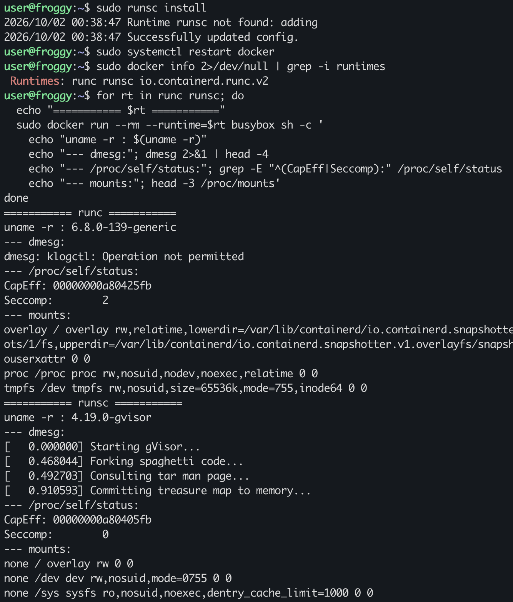

| | runc | runsc |
|---|---|---|
| `uname -r` | `6.8.0-139-generic` — ядро хоста | `4.19.0-gvisor` — версия, которую изображает Sentry |
| `dmesg` | `Operation not permitted`: буфер ядра хоста закрыт seccomp-профилем Docker и отсутствием `CAP_SYSLOG` | шуточный лог загрузки: буфера ядра хоста здесь просто нет |
| `/proc/mounts` | настоящие пути хоста `/var/lib/containerd/.../snapshots/47/fs` | `none / overlay` — таблица монтирования Sentry, о хосте ничего |
| `CapEff` | `a80425fb` — 14 capabilities Docker | `a80405fb` — без `CAP_NET_RAW`: raw-сокеты в gVisor по умолчанию выключены |
| `Seccomp` | `2` — фильтр Docker в ядре хоста | `0` — Sentry не применяет к приложению профиль Docker, защита стоит уровнем ниже, на самом Sentry |

Под runc контейнер узнаёт о хосте версию ядра и даже пути к снапшотам на
диске. Под runsc он не узнаёт ничего: ему отвечает не ядро хоста.

### Сервис под gVisor и вид с хоста

```bash
sudo docker run -d --name api-gv --runtime=runsc -p 127.0.0.1:8081:8080 \
  --memory 100m --cpus 0.5 --pids-limit 64 api:multi
curl -s localhost:8081/health
curl -s localhost:8081/info
```

```text
ok
{
  "pid": 1,
  "ppid": 0,
  "uid": 65534,
  "hostname": "3aee12ab4d24",
  "num_cpu": 2,
  "cgroup": "7:pids:/3aee12ab…\n6:memory:/3aee12ab…\n5:job:/3aee12ab…\n4:devices:/…\n3:cpuset:/…\n2:cpuacct:/…\n1:cpu:/…",
  "proc_status": {
    "CapBnd": "00000000a80405fb",
    "CapEff": "0000000000000000",
    "NoNewPrivs": "0",
    "Seccomp": "0",
    "Threads": "4",
    ...
  }
}
```

Сервис работает. Теперь ищем его на хосте:

```bash
ps -eo pid,ppid,user,comm | grep -E 'runsc|containerd-shim|api' | grep -v grep
P=$(sudo docker inspect -f '{{.State.Pid}}' api-gv); echo "P=$P"
ps -o pid,ppid,user,comm,args -p $P | cut -c1-150
sudo grep -E '^(Uid|CapEff|Seccomp|Seccomp_filters|Threads):' /proc/$P/status
cat /proc/$P/cgroup
pgrep -x api || echo "процесса с именем api на хосте нет"
```

```text
 119426       1 root     containerd-shim
 119450  119426 root     runsc-fd-parkin
P=119448
    PID    PPID USER     COMMAND         COMMAND
 119448  119426 root     gvisor_sentry   runsc-sandbox --root=/var/run/docker/runtime-runc/moby --log=/run/containerd/io.containerd.runtime.v2.task/mo
Uid:    0    0    0    0
Threads:    16
CapEff:    000000000008001f
Seccomp:    2
Seccomp_filters:    1
0::/system.slice/docker-3aee12ab4d245ef7f55e8d6cbda80edbcd13402f724f83e9808374b1a7e7b476.scope
процесса с именем api на хосте нет
```

Разбираем:

- **Процесса `api` на хосте нет.** PID из `docker inspect` — это
  `gvisor_sentry`: «ядро» песочницы, внутри которого `api` работает как PID 1
  и считает себя обычным процессом Linux.
- **Sentry сам под seccomp** (`Seccomp: 2`) и с урезанным набором
  capabilities (`0x8001f` — `chown`, `dac_override`, `dac_read_search`,
  `fowner`, `fsetid`, `sys_ptrace`). Это и есть узкая дверь в ядро хоста.
- **cgroup изнутри нарисован.** `/info` показывает иерархию в стиле cgroup v1
  с контроллером `job`, которого в Linux нет: это cgroupfs, который
  изображает Sentry. Настоящий лимит висит снаружи на всей песочнице —
  `docker-3aee....scope` в cgroup v2 хоста, вместе с памятью и CPU самого
  Sentry.
- `NSpid` в `/info` нет: Sentry не изображает вложенные pid namespaces.

### Выводы

**Чем gVisor устроен иначе.** Под runc `write()` из `api` попадает прямо в
ядро хоста — в ту же реализацию, что обслуживает все процессы машины;
namespaces, cgroups, capabilities и seccomp лишь решают, пустить ли вызов и
что он увидит. Под gVisor тот же `write()` перехватывает Sentry и исполняет
сам, своим кодом на Go: сетевой стек, файловая система, `/proc`, cgroupfs —
всё его. В ядро хоста Sentry ходит сам, когда нужно, — несколькими десятками
вызовов под собственным seccomp, без операций с namespaces, без `mount`, без
`ptrace` чужих процессов.

**Почему это изолированнее.** Уязвимость в обработке системного вызова
ядром хоста под runc достижима из контейнера напрямую: достаточно сделать
этот вызов. Под gVisor приложение до этого кода не дотягивается, его вызовы
обрабатывает Sentry. Чтобы сбежать, нужны две уязвимости подряд: сначала в
Sentry (и выйти получится только в процесс песочницы, который сам под
seccomp, в своих namespaces и с урезанными правами), затем в той узкой части
ядра хоста, которую Sentry разрешено вызывать. Заодно не утекает информация
о хосте: версия ядра, `dmesg`, пути на диске.

**Цена.** Каждый системный вызов приложения — лишний переход в Sentry и
обратно, а сеть и файлы идут через реализацию в user space. Сильнее всего
это бьёт по нагрузкам с большим числом мелких вызовов: сеть с маленькими
пакетами, много мелких файловых операций, `fork` и `exec`. Растут latency и
расход CPU. Плюс совместимость: Sentry реализует не все вызовы и не все файлы
`/proc` и `/sys`, часть софта (например, с raw-сокетами) работает иначе или
не работает.

| | `mydocker.sh` | Docker (runc) | Docker (runsc) |
|---|---|---|---|
| какое ядро обрабатывает вызовы приложения | хоста | хоста | Sentry в user space |
| что приложение видит о хосте | всю ФС, `uname` хоста | `uname`, пути в `/proc/mounts` | ничего: `4.19.0-gvisor`, свой `dmesg` |
| что стоит до кода ядра хоста | seccomp, capabilities, user namespace | seccomp, capabilities, AppArmor | Sentry, его seccomp, namespaces песочницы |
| накладные расходы | почти нет | почти нет | на каждый системный вызов |

**Что у обычного контейнера всегда общее с хостом и почему это предел.**
**Ядро.** Namespaces — это метки на объектах одного и того же ядра, cgroups —
счётчики в нём же, seccomp и capabilities — проверки в его же коде. Всё это
работает, только пока ядро работает правильно. Ошибка в любом системном
вызове, доступном контейнеру, — ошибка в ядре, которое управляет всей
машиной, и её эксплуатация даёт выход за все барьеры сразу. Примеры — Dirty
COW (CVE-2016-5195) и Dirty Pipe (CVE-2022-0847): запись в read-only страницы
кэша, в том числе в файлы хоста и чужих контейнеров, из непривилегированного
процесса. Кроме ядра общими остаются железо (кэши CPU, отсюда атаки класса
Spectre и Meltdown), системные часы и интерфейсы ядра без namespaces
(keyrings, часть `/proc/sys`). Поэтому граница доверия контейнера — ядро. Для
недоверенного кода нужен отдельный «ядерный» слой: ядро в user space (gVisor)
или отдельное ядро в микро-VM (Kata, Firecracker).

---

## Часть 8. Мониторинг

Всё, что в части 3 мы смотрели руками в `memory.events`, `cpu.stat` и
`pids.events`, нужно видеть непрерывно и по всем контейнерам. Задача — снять
метрики контейнера, собрать дашборд и выбрать три метрики под алерты.

### Стек

cAdvisor читает те же файлы cgroup v2 и отдаёт их как метрики Prometheus,
Grafana рисует. Новой информации здесь нет — это те же счётчики ядра, только
во времени. Всё лежит в [`monitoring/`](monitoring/):

- [`compose.yaml`](monitoring/compose.yaml) — cAdvisor v0.49.1, Prometheus
  v3.5.0, Grafana 12.1.1, всё на `127.0.0.1`. У cAdvisor включён
  `--docker_only=false`, поэтому в метрики попадают и cgroup `mydocker-<pid>`
  от нашего скрипта;
- [`containers.json`](monitoring/grafana/dashboards/containers.json) —
  дашборд, Grafana подхватывает его сама;
- [`alerts.yml`](monitoring/prometheus/alerts.yml) — правила алертов.

```bash
sudo apt install -y docker-compose-v2
cd monitoring
sudo docker compose up -d
sleep 15; curl -s localhost:9090/api/v1/targets | grep -o '"health":"[a-z]*"'
```

```text
"health":"up"
```

Prometheus достучался до cAdvisor и собирает метрики.

### Дашборд

Логика у дашборда одна: каждый ресурс показан против своего потолка, на одной
оси и в одной единице, лимит — пунктиром.

| Панель | Источник в cgroup | Зачем |
|---|---|---|
| Memory, % of memory.max | (`memory.current` − `inactive_file`) / `memory.max` | насколько близко OOM |
| CPU throttled periods, % | `nr_throttled / nr_periods` из `cpu.stat` | упирается ли в квоту прямо сейчас |
| Restarts / OOM kills | смена времени старта cgroup; `oom_kill` из `memory.events` | сколько раз уже убивали |
| Tasks, % of pids.max | `pids.current / pids.max` | насколько близко `EAGAIN` на `fork` |
| четыре графика | те же величины во времени, лимит пунктиром | форма нагрузки: рост, всплески, плато |

Запускаем контейнер с теми же лимитами, что во всей лабе, и
`--restart on-failure`, чтобы после OOM он поднимался сам, и гоняем сценарий:
сначала CPU, потом два раза по 60 МБ памяти:

```bash
sudo docker run -d --name api -p 127.0.0.1:8080:8080 --restart on-failure \
  --memory 100m --memory-swap 100m --cpus 0.5 --pids-limit 64 api:multi
curl -s localhost:8080/burn;  sleep 90; curl -s localhost:8080/stop
curl -s 'localhost:8080/eat?mb=60'; sleep 30
curl -s 'localhost:8080/eat?mb=60'; sleep 20
sudo docker inspect -f 'restarts={{.RestartCount}} oom={{.State.OOMKilled}}' api
```

```text
burning on 1 core(s), GET /stop to stop
stopped 1 burner(s)
held 60 MB
restarts=1 oom=false
```

Первый сбой здесь — в самом `docker inspect`: контейнер убит по OOM и
перезапущен, а `oom=false`. `State.OOMKilled` описывает текущий запуск, а
после рестарта это уже новый процесс, которого никто не убивал. Факт
убийства остался только в `RestartCount`.

### Сбои первой версии дашборда

На первом скриншоте дашборда нашлось три проблемы:

1. **Панель OOM-kill показывала ноль**, хотя OOM был. Об этом ниже, отдельно.
2. **Шум.** На графиках были контейнеры самого мониторинга и уже удалённый
   gVisor-контейнер. Теперь панели показывают только контейнеры с лимитом
   памяти: мониторинг работает без лимитов.
3. **Вместо имён — ID.** cAdvisor v0.49 не договорился с Docker о версии API
   и не получает метаданных контейнеров. Метрики при этом есть — они берутся
   из cgroup по пути, поэтому запросы фильтруют по пути cgroup, а не по
   имени. `docker-e23637c12d11` — это наш `api`.

После исправлений нашлась ещё одна ошибка, уже в запросе: панель рестартов
показывала `No data` с красным треугольником. В PromQL окно `[1h]` можно
приписать только селектору метрики, а не выражению в скобках:
`changes((a and b)[1h])` — синтаксическая ошибка. Правильно — сначала
`changes(a[1h])`, потом фильтр `and b`.

### OOM-счётчик теряет события

Проверяем, был ли OOM на самом деле и что видит Prometheus:

```bash
sudo dmesg | grep 'Memory cgroup out of memory' | tail -2
sudo docker inspect -f 'restarts={{.RestartCount}}' api
curl -s 'localhost:9090/api/v1/query?query=container_oom_events_total' | grep -o '"value":\[[^]]*\]' | head -3
```

```text
[31477.013592] Memory cgroup out of memory: Killed process 120674 (api) total-vm:1398340kB, anon-rss:101504kB, file-rss:5504kB, shmem-rss:0kB, UID:65534 pgtables:312kB oom_score_adj:0
[33917.467362] Memory cgroup out of memory: Killed process 121014 (api) total-vm:1398420kB, anon-rss:101504kB, file-rss:5504kB, shmem-rss:0kB, UID:65534 pgtables:312kB oom_score_adj:0
restarts=2
"value":[1790905386.141,"0"]
"value":[1790905386.141,"0"]
"value":[1790905386.141,"0"]
```

Ядро убивало дважды, Docker дважды перезапустил контейнер, а
`container_oom_events_total` — ноль.

Причина в том, где живёт счётчик. `oom_kill` лежит в `memory.events` той
самой cgroup, которую убийство уничтожает: процесс убит, контейнер
завершился, systemd удалил scope. cAdvisor с интервалом 5 с не успевает
увидеть ненулевое значение, а перезапущенный контейнер получает новую cgroup
со счётчиком 0. Улика уничтожается вместе с местом происшествия.

Выживает сам рестарт: у новой cgroup новое время старта
(`container_start_time_seconds`). На нём и построены панель и алерт. По той
же причине Kubernetes берёт `OOMKilled` не из cAdvisor, а из статуса
контейнера в рантайме (`kube_pod_container_status_last_terminated_reason`).

### Три алерта

| Алерт | Условие | Тип | Что ловит | Чем грозит |
|---|---|---|---|---|
| `ContainerMemoryNearLimit` | working set > 90% `memory.max` дольше 2 мин | предсказывает | память подошла к потолку и держится там | следующая страница, которая не влезет, — reclaim и OOM-kill |
| `ContainerCPUThrottled` | throttled > 25% CFS-периодов (окно 5 мин) дольше 5 мин | уже вредит | квоты не хватает, потоки стоят до конца периода | рост latency и таймауты, при этом средняя загрузка выглядит нормальной |
| `ContainerOOMKilledOrRestarted` | время старта cgroup изменилось или выросли `oom_events` за 10 мин | факт | процесс убит (OOM или падение) и перезапущен | потеря запросов в полёте и состояния в памяти; повторы — crash loop |

Подгружаем правила и проверяем, что Prometheus их видит:

```bash
sudo docker compose restart prometheus
curl -s localhost:9090/api/v1/rules | grep -o '"name":"Container[A-Za-z]*"'
```

```text
"name":"ContainerMemoryNearLimit"
"name":"ContainerCPUThrottled"
"name":"ContainerOOMKilledOrRestarted"
```

Сценарий для проверки: держим память около 96% лимита и грузим CPU больше
квоты, ждём дольше `for`, потом добиваем память до OOM:

```bash
curl -s localhost:8080/free
curl -s 'localhost:8080/eat?mb=90'
curl -s localhost:8080/burn
sleep 330
curl -s localhost:9090/api/v1/alerts | grep -oE '"alertname":"[A-Za-z]+"|"state":"[a-z]+"'
curl -s 'localhost:8080/eat?mb=20'
sleep 30
curl -s localhost:9090/api/v1/alerts | grep -oE '"alertname":"[A-Za-z]+"|"state":"[a-z]+"'
```

До OOM:

```text
"alertname":"ContainerMemoryNearLimit"
"state":"firing"
"alertname":"ContainerCPUThrottled"
"state":"firing"
```

После OOM:

```text
"alertname":"ContainerCPUThrottled"
"state":"firing"
"alertname":"ContainerOOMKilledOrRestarted"
"state":"firing"
```

Сработали все три. После OOM `ContainerMemoryNearLimit` погас, потому что
новый процесс начал с пустой памятью, а `ContainerCPUThrottled` ещё горит: в
его окне `rate(...[5m])` пока лежат периоды старого процесса.

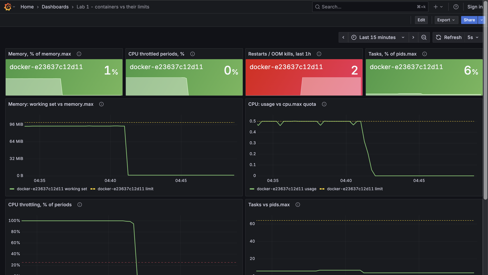

На дашборде видно, как память встала на ~96 MiB под пунктиром лимита, CPU
упёрся в 0.5 ядра, throttling держался около 100% периодов, задачи заняли
около 6% от `pids.max`, а после OOM память и CPU провалились в ноль, и
контейнер перезапустился.

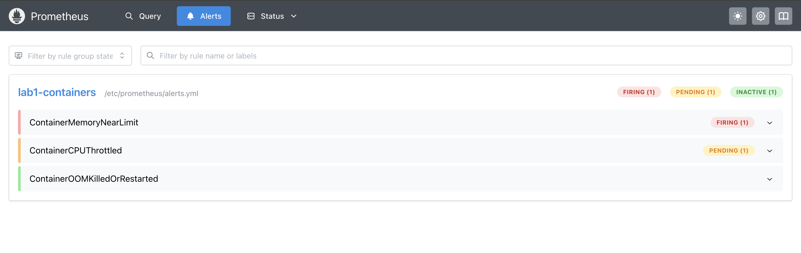

## Docker my beloved


