# Лаба 2 — Мониторинг сервиса: метрики, логи, трейсы

Цель лабы — поднять вокруг одного сервиса полный мониторинг: метрики в
Prometheus и Grafana, логи в Loki, трейсы в Jaeger, алерты в Alertmanager и
Karma. Всё работает в локальном Kubernetes и ставится только через Helm.

- **Сервис:** Go 1.27; Prometheus client, OpenTelemetry, log/slog.
- **Окружение:** MacBook (arm64, 8 CPU, 8 ГБ), Docker Desktop,
  minikube 1.39.0, Kubernetes 1.37.1, Helm 4.3.0.

---

## Часть 0. Сервис


| Эндпоинт | Что делает |
|---|---|
| `GET /health` | отвечает `ok` |
| `GET /fail` | отвечает 500, помечает спан как ошибочный, пишет лог уровня `ERROR` |
| `GET /slow` | спит 1–3 с во вложенном спане `slow-op` |
| `GET /load?n=50&path=/health` | шлёт пачку запросов к самому себе, по 10 одновременно; `path` — `/health`, `/fail` или `/slow` |
| `GET /metrics` | метрики Prometheus |
| `GET /healthz` | `ok` без метрик, логов и трейсов — для проб kubelet |

Что сервис отдаёт мониторингу:

- **Метрики RED.** `http_requests_total{route,method,code}` — интенсивность,
  `http_request_errors_total{route,method}` — ошибки (все ответы 5xx),
  гистограмма `http_request_duration_seconds{route,method}` — время ответа.
- **Логи.** JSON в stdout, по строке на запрос: `trace_id`, `span_id`,
  `route`, `status`, `duration_ms`. Ответы 5xx пишутся уровнем `ERROR`.
- **Трейсы.** OpenTelemetry через `otelhttp`: на каждый входящий запрос —
  корневой спан, названный по маршруту (`GET /slow`). Экспорт по OTLP/HTTP включается переменной
  `OTEL_EXPORTER_OTLP_ENDPOINT`. Без неё SDK всё равно работает, и
  `trace_id` в логах есть.
- **`/load` ходит к себе через инструментированный HTTP-клиент**, поэтому
  вся пачка запросов собирается в Jaeger в один трейс.

`/healthz` отдельно от `/health` — сознательное решение: пробы kubelet ходят
каждые несколько секунд, и если бы они шли в инструментированный эндпоинт,
они забили бы логи и Jaeger и исказили бы RED-метрики.

Проверяем локально, без кластера:

```bash
make run
make smoke
```

```text
GET /health -> ok
GET /fail   -> 500
GET /slow   -> slept 2425 ms
GET /load   -> sent 20 requests to /health: map[200:20]
```

---

## Часть 0.5. Кластер и сервис в нём

### Версии

Перед установкой версии сверены с GitHub releases и Helm-репозиториями:

| Компонент | Версия |
|---|---|
| minikube | 1.39.0 |
| Kubernetes | 1.37.1 |
| Helm | 4.3.0 |
| kube-prometheus-stack | chart 91.8.2: Prometheus 3.15.0, Alertmanager 0.34.1, Grafana 13.2.3 |
| Loki | chart `grafana-community/loki` 18.13.7: Loki 3.7.8 |
| Grafana Alloy | chart `grafana/alloy` 1.13.0: Alloy 1.20 |
| Jaeger | chart `jaegertracing/jaeger` 4.13.1: Jaeger 2.20.0 |
| Karma | 0.133 |

По дороге выяснилось, что Grafana Labs переносит чарты в `grafana-community`:
`grafana/grafana` уже помечен `deprecated: true`, а `grafana/loki` отстаёт
(7.3.0 с Loki 3.6.12). Поэтому Loki берём из `grafana-community`, а Grafana —
из kube-prometheus-stack, который сам тянет её оттуда же.

### Кластер

```bash
minikube delete --all
minikube start --driver=docker --cpus=4 --memory=5000mb --kubernetes-version=v1.37.1
kubectl get nodes -o wide
```

```text
* Подготавливается Kubernetes v1.37.1 на containerd 2.3.4 ...
* Включенные дополнения: storage-provisioner, default-storageclass
NAME       STATUS   ROLES           AGE   VERSION   INTERNAL-IP    OS-IMAGE                         CONTAINER-RUNTIME
minikube   Ready    control-plane   4s    v1.37.1   192.168.49.2   Debian GNU/Linux 12 (bookworm)   containerd://2.3.4
```


### Образ

Образ собираем прямо в кластер, без registry:

```bash
minikube image build -t api:lab2 .
minikube image ls | grep api:lab2
```

```text
#12 naming to docker.io/library/api:lab2 done
docker.io/library/api:lab2
```

### Helm-чарт сервиса

Лаба требует ставить всё через Helm, и сервис тоже. Чарт
[`charts/api/`](charts/api/) минимальный:

- **Deployment** с образом `api:lab2` и `imagePullPolicy: Never` — образ уже
  лежит в containerd кластера, тянуть его неоткуда. Пробы — на `/healthz`.
  Контейнер не от root, файловая система только для чтения, все capabilities
  сброшены. Переменная `OTEL_EXPORTER_OTLP_ENDPOINT` берётся из values и
  пока пустая.
- **Service** на порт 8080 с именованным портом `http`.
- **ServiceMonitor** — выключен: его CRD появится в кластере только вместе с
  kube-prometheus-stack.

```bash
helm upgrade --install api charts/api -n app --create-namespace --wait
kubectl -n app get pods,svc
```

```text
NAME                      READY   STATUS    RESTARTS   AGE
pod/api-669799666-d2q52   1/1     Running   0          1s

NAME          TYPE        CLUSTER-IP      EXTERNAL-IP   PORT(S)    AGE
service/api   ClusterIP   10.101.199.50   <none>        8080/TCP   1s
```

### Обвязка чартов

Первая версия обоих своих чартов (`api` и `alert-receiver`) была написана
руками без стандартной обвязки, которую даёт `helm create`. Позже она
добавлена:

- **`.helmignore`.** Helm берёт в чарт все файлы его каталога: они попадают в
  `.tgz` и в секрет релиза (`sh.helm.release.v1.*`), где хранится весь чарт,
  а у секрета лимит 1 МБ.
- **`_helpers.tpl`.** Имя объектов, selector-метки и стандартные метки
  (`app.kubernetes.io/version`, `managed-by`, `helm.sh/chart`).
- **`values.schema.json`** у `api`: неверные values ловятся при
  `helm template` / `install`, до кластера.
- **`NOTES.txt`**: после установки — как достучаться до сервиса и что
  включено.
- **`seccompProfile: RuntimeDefault`** у подов, тег образа по умолчанию — из
  `appVersion` чарта, `kubeVersion` в `Chart.yaml`.

Проверка схемы — три ошибки в values разом:

```bash
helm template api charts/api --set replicas=-1 --set otlpEndpoint=jaeger:4318 --set serviceMonitor.interval=15
```

```text
Error: values don't meet the specifications of the schema(s) in the following chart(s):
api:
- at '/replicas': minimum: got -1, want 0
- at '/otlpEndpoint': 'jaeger:4318' does not match pattern '^$|^https?://'
- at '/serviceMonitor/interval': got number, want string
```

### Проверка
Пробрасываем порт сервиса на Mac и прогоняем smoke:

```bash
kubectl -n app port-forward svc/api 18080:8080 &
make smoke URL=http://127.0.0.1:18080
```

```text
GET /health -> ok
GET /fail   -> 500
GET /slow   -> slept 2709 ms
GET /load   -> sent 20 requests to /health: map[200:20]
GET /metrics:
http_request_errors_total{method="GET",route="/fail"} 1
http_requests_total{code="200",method="GET",route="/health"} 21
http_requests_total{code="200",method="GET",route="/load"} 1
http_requests_total{code="200",method="GET",route="/slow"} 1
http_requests_total{code="500",method="GET",route="/fail"} 1
```

```bash
kubectl -n app logs deploy/api --tail=3
```

```text
{"time":"2026-10-02T23:15:09.007882464Z","level":"INFO","msg":"request","trace_id":"be5cd1448695cc423562311ce33c5ab3","span_id":"af283ff7a94dc516","method":"GET","route":"/health","status":200,"duration_ms":0,"remote":"127.0.0.1:55928"}
{"time":"2026-10-02T23:15:09.008042755Z","level":"INFO","msg":"load done","trace_id":"be5cd1448695cc423562311ce33c5ab3","span_id":"684239ebf85d33f2","n":20,"path":"/health","codes":"map[200:20]"}
{"time":"2026-10-02T23:15:09.008060839Z","level":"INFO","msg":"request","trace_id":"be5cd1448695cc423562311ce33c5ab3","span_id":"684239ebf85d33f2","method":"GET","route":"/load","status":200,"duration_ms":4,"remote":"127.0.0.1:55828"}
```

---

## Часть 1. Метрики: Prometheus и Grafana

### kube-prometheus-stack

Ставим kube-prometheus-stack: Prometheus Operator, Prometheus, Alertmanager,
Grafana, kube-state-metrics, node-exporter. 


Values — [`helm/kube-prometheus-stack.yaml`](helm/kube-prometheus-stack.yaml).
Что в них меняет поведение:

- `fullnameOverride: kps` — короткие имена объектов;
- `kubeEtcd`, `kubeControllerManager`, `kubeScheduler`, `kubeProxy` выключены:
  minikube не открывает их для сбора, и они дали бы только вечно горящие
  алерты `TargetDown`;
- `serviceMonitorSelectorNilUsesHelmValues: false` (и то же для правил) —
  по умолчанию оператор берёт только ServiceMonitor'ы с меткой своего
  релиза, а так берёт все. Чарт сервиса может объявить о себе, не зная имени
  релиза мониторинга;
- Grafana ищет дашборды в ConfigMap'ах со всех namespace.

```bash
helm repo add prometheus-community https://prometheus-community.github.io/helm-charts
helm upgrade --install kps prometheus-community/kube-prometheus-stack \
  --version 91.8.2 -n monitoring --create-namespace -f helm/kube-prometheus-stack.yaml --wait
kubectl -n monitoring get pods
```

```text
NAME                                     READY   STATUS    RESTARTS   AGE
alertmanager-kps-alertmanager-0          2/2     Running   0          93s
kps-grafana-5d46674949-l99r2             3/3     Running   0          117s
kps-kube-state-metrics-747b7b996-p88rb   1/1     Running   0          117s
kps-operator-9f5757698-6h72x             1/1     Running   0          117s
kps-prometheus-node-exporter-s7fcp       1/1     Running   0          117s
prometheus-kps-prometheus-0              2/2     Running   0          93s
```

### Сбор метрик сервиса

Включаем в чарте сервиса ServiceMonitor ([`helm/api.yaml`](helm/api.yaml)):

```bash
helm upgrade --install api charts/api -n app -f helm/api.yaml --wait
kubectl -n monitoring port-forward svc/kps-prometheus 19090:9090 &
curl -s 'http://127.0.0.1:19090/api/v1/targets?state=active' | grep -c 'app/api'
```

```text
serviceMonitor/app/api/0 http://10.244.0.3:8080/metrics up -
```

### RED-дашборд

Дашборд лежит в чарте сервиса
([`charts/api/dashboards/red.json`](charts/api/dashboards/red.json)) и
ставится как ConfigMap с меткой `grafana_dashboard: "1"`. Sidecar Grafana
подхватывает такие ConfigMap'ы, так что дашборд живёт и версионируется вместе
с сервисом.

| Панель | PromQL |
|---|---|
| Rate | `sum(rate(http_requests_total{job="api"}[1m]))`, и по `route`, и по `code` |
| Errors | `sum(rate(http_request_errors_total[1m])) / sum(rate(http_requests_total[1m]))`, всего и по `route` |
| Duration | `histogram_quantile(0.95, sum by (le) (rate(http_request_duration_seconds_bucket[1m])))`, плюс p50, p99 и p95 по `route` |
| Pods scraped | `sum(up{job="api"})` |

```bash
helm upgrade --install api charts/api -n app -f helm/api.yaml --wait
kubectl -n monitoring port-forward svc/kps-grafana 3000:80 &
GF_PASS=$(kubectl -n monitoring get secret grafana-admin -o jsonpath='{.data.admin-password}' | base64 -d)
curl -s -u "admin:$GF_PASS" 'http://127.0.0.1:3000/api/search?query=RED'
```

```text
api-red api - RED
```

### Проверка под нагрузкой

Даём пять минут нагрузки: пачки `/load` по 100 запросов, по три `/fail` и по
одному `/slow` каждые две секунды:

```bash
B=http://127.0.0.1:18080
end=$((SECONDS+300))
while [ $SECONDS -lt $end ]; do
  curl -s "$B/load?n=100" >/dev/null
  for i in 1 2 3; do curl -s $B/fail >/dev/null; done
  curl -s $B/slow >/dev/null &
  sleep 2
done
```

Те же запросы, что на дашборде, напрямую в Prometheus:

```bash
q() { curl -s http://127.0.0.1:19090/api/v1/query --data-urlencode "query=$1"; }
q 'sum by (route) (rate(http_requests_total{job="api"}[1m]))'
q 'sum(rate(http_request_errors_total{job="api"}[1m])) / sum(rate(http_requests_total{job="api"}[1m]))'
q 'histogram_quantile(0.95, sum by (le, route) (rate(http_request_duration_seconds_bucket{job="api"}[1m])))'
```

```text
RPS по route:
    /health 4.48
    /load 0.044
    /slow 0.022
    /fail 0.133
Доля ошибок:
     0.028
p95 по route, с:
    /fail 0.005
    /health 0.005
    /load 0.024
    /slow 2.685
```

Все три сигнала реагируют: `/load` поднимает RPS `/health`, `/fail` даёт долю
ошибок, `/slow` вытягивает p95 к 2.7 с. Цифры сняты в первую минуту, пока
окно `[1m]` ещё не заполнилось, поэтому RPS здесь занижен.

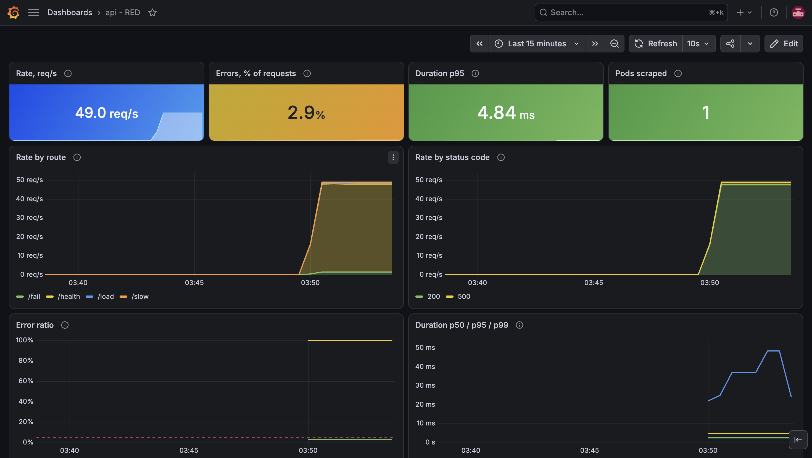

На скриншоте около 49 req/s, 2.9% ошибок, p95 — 4.84 мс. На панели Error
ratio линия на 100% — это `/fail`, у которого по определению все ответы
ошибочные; общая доля — нижняя, около 3%.

Самое интересное — **общий p95 4.84 мс, хотя `/slow` отвечает 1–3 секунды**.
Даже p99 держится в районе 20–50 мс. `/slow` — около 1% трафика, а 98% —
быстрые `/health` от `/load`, и перцентиль по всему сервису редкий медленный
эндпоинт просто не видит. Алерт «p95 сервиса больше секунды» здесь молчал бы,
пока пользователи `/slow` ждут по 3 секунды. Поэтому на дашборде есть
отдельная панель p95 по маршрутам, и это же учтём в алертах.

---

## Часть 2. Логи: Loki и Alloy

Задача — собрать логи сервиса в Loki, подключить Loki к той же Grafana и
найти там ошибку от `/fail`.

Роли здесь разделены. **Loki — только хранилище**: он принимает логи по HTTP
и отвечает на запросы, но сам ниоткуда их не забирает. Собирает **агент** на
каждой ноде — Grafana Alloy. Он читает файлы, в которые container runtime
пишет stdout контейнеров (`/var/log/pods/...`), добавляет метки Kubernetes и
отправляет строки в Loki.

### Loki

Чарт `grafana-community/loki` по умолчанию рассчитан на продакшен: хранилище
S3, replication factor 3, по три реплики read/write/backend, memcached для
кэшей и canary. Для одной ноды это лишнее. Values
([`helm/loki.yaml`](helm/loki.yaml)) сводят Loki к одному процессу с
хранением на диске:

- `deploymentMode: Monolithic`, `singleBinary.replicas: 1`, реплики
  read/write/backend — 0;
- `storage.type: filesystem`, `replication_factor: 1`;
- схема `tsdb` `v13` — нужна для structured metadata;
- `auth_enabled: false` — один тенант, агенту и Grafana не нужен заголовок
  `X-Scope-OrgID`;
- выключены кэши memcached, canary, тесты и gateway: Alloy и Grafana ходят в
  сервис `loki:3100` напрямую.

```bash
helm upgrade --install loki oci://ghcr.io/grafana-community/helm-charts/loki \
  --version 18.13.7 -n monitoring -f helm/loki.yaml --wait
kubectl -n monitoring get pods -l app.kubernetes.io/name=loki
kubectl get --raw /api/v1/namespaces/monitoring/services/loki:3100/proxy/ready
```

```text
NAME     READY   STATUS    RESTARTS   AGE
loki-0   2/2     Running   0          56s
ready
```

### Alloy

Alloy ставится DaemonSet'ом — по поду на каждую ноду, и каждый читает файлы
своей ноды. Values чарта — [`helm/alloy.yaml`](helm/alloy.yaml), сам пайплайн
— отдельный файл [`helm/files/config.alloy`](helm/files/config.alloy)

1. `discovery.kubernetes` — поды только своей ноды
   (`spec.nodeName=$HOSTNAME`);
2. `discovery.relabel` — метки `namespace`, `pod`, `container`, `app` и путь
   к файлу лога: `/var/log/pods/*<uid>/<container>/*.log`;
3. `loki.source.file` — читает эти файлы;
4. `loki.process`:
   - `stage.cri` снимает обёртку runtime (`<время> stdout F <строка>`);
   - `stage.json` достаёт из JSON-строки `level` и `trace_id`;
   - `level` становится меткой — значений у него несколько;
   - `trace_id` уходит в **structured metadata**, а не в метку (почему —
     в ответах на вопросы);
5. `loki.write` — отправляет в `http://loki.monitoring.svc:3100/loki/api/v1/push`.

```bash
helm repo add grafana https://grafana.github.io/helm-charts
helm upgrade --install alloy grafana/alloy --version 1.13.0 -n monitoring \
  -f helm/alloy.yaml --set-file alloy.configMap.content=helm/files/config.alloy --wait   # или make deploy-alloy
kubectl -n monitoring get ds,pods -l app.kubernetes.io/name=alloy
```

```text
NAME                   DESIRED   CURRENT   READY   UP-TO-DATE   AVAILABLE   NODE SELECTOR   AGE
daemonset.apps/alloy   1         1         1       1            1           <none>          64s

NAME              READY   STATUS    RESTARTS   AGE
pod/alloy-69qqb   2/2     Running   0          64s
```

### Ищем ошибку

Дёргаем `/fail` и спрашиваем Loki напрямую, через API-прокси Kubernetes:

```bash
curl -s -o /dev/null -w 'fail -> %{http_code}\n' http://127.0.0.1:18080/fail
P=/api/v1/namespaces/monitoring/services/loki:3100/proxy/loki/api/v1
kubectl get --raw "$P/labels"
kubectl get --raw "$P/label/level/values"
kubectl get --raw "$P/query_range?query=%7Bnamespace%3D%22app%22%2C%20app%3D%22api%22%2C%20level%3D%22ERROR%22%7D&limit=3&since=5m"
```

```text
fail -> 500
labels: ['__stream_shard__', 'app', 'container', 'filename', 'level', 'namespace', 'pod', 'service_name', 'stream']
level values: ['ERROR', 'INFO', 'WARNING']
stream: {'app': 'api', 'container': 'api', 'detected_level': 'error', 'level': 'ERROR', 'namespace': 'app', 'pod': 'api-669799666-d2q52', 'service_name': 'api', 'stream': 'stdout', 'trace_id': 'd0417c83e8b295c8e7f7d6869487d547', ...}
   {"time":"2026-10-03T10:23:51.509931503Z","level":"ERROR","msg":"request","trace_id":"d0417c83e8b295c8e7f7d6869487d547","span_id":"14274afd2c045207","method":"GET","route":"/fail","status":500,"duration_ms":1,...}
   {"time":"2026-10-03T10:23:51.509394003Z","level":"ERROR","msg":"handler failed","trace_id":"d0417c83e8b295c8e7f7d6869487d547","span_id":"14274afd2c045207","error":"simulated failure"}
```

Ошибка нашлась по запросу `{namespace="app", app="api", level="ERROR"}`:
обе строки одного запроса — строка обработчика и строка с итогом, — с одним
`trace_id`. Сам `trace_id` есть у строки, но его нет в списке меток: он лёг в
structured metadata, как и задумано.

### Loki в Grafana

Источник данных Loki добавлен в values kube-prometheus-stack
(`grafana.additionalDataSources`), чтобы он тоже задавался конфигом, а не
кликами:

```yaml
grafana:
  additionalDataSources:
    - name: Loki
      uid: loki
      type: loki
      url: http://loki.monitoring.svc:3100
```

```bash
helm upgrade kps prometheus-community/kube-prometheus-stack --version 91.8.2 \
  -n monitoring -f helm/kube-prometheus-stack.yaml --wait
curl -s -u "admin:$GF_PASS" http://localhost:3000/api/datasources/uid/loki/health
```

```text
{"message":"Data source successfully connected.","status":"OK"}
```

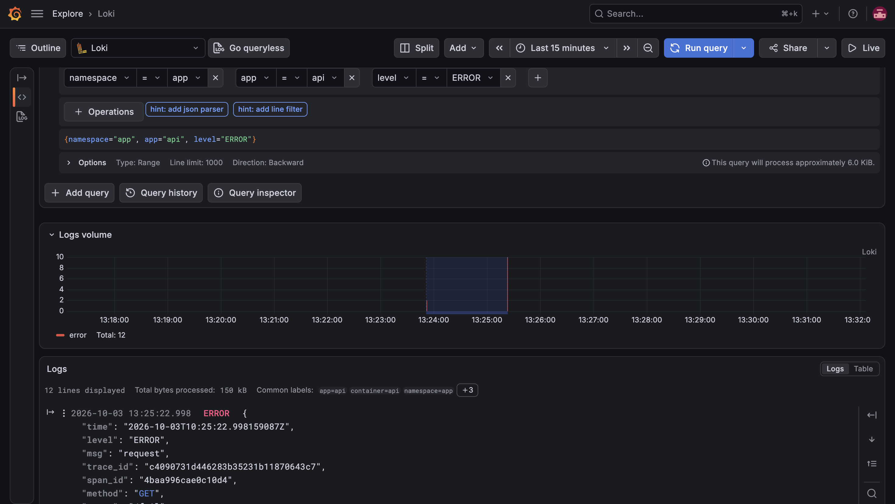

Раскрытые строки: обе строки одного запроса `/fail` — `request` и
`handler failed` — с одним `trace_id`.

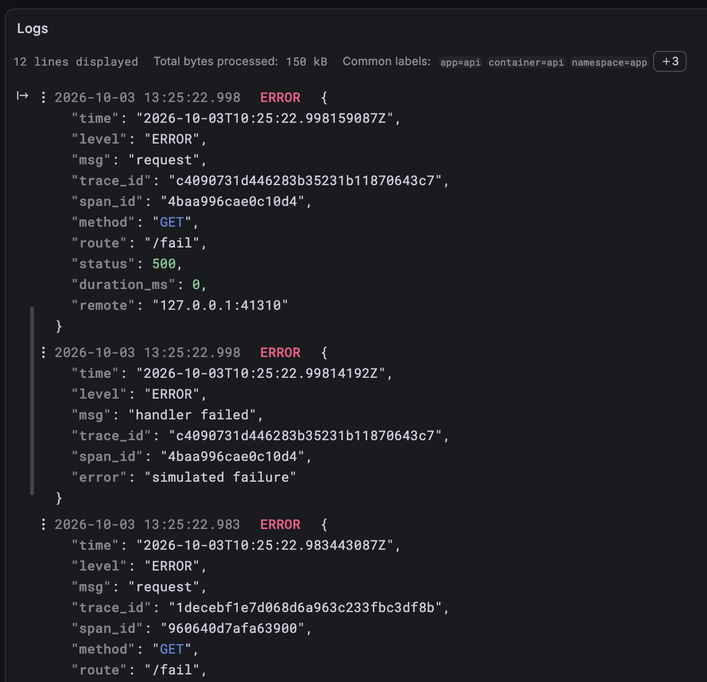

---

## Часть 3. Трейсы: OpenTelemetry и Jaeger

Задача — довести трейсы сервиса до Jaeger, найти в нём водопад `/slow` с
вложенным спаном и красный спан `/fail`, и научиться переходить от строки
лога к её трейсу.

Сервис уже инструментирован: `otelhttp` создаёт корневой спан на
каждый запрос, `/slow` оборачивает во вложенный спан `slow-op`, `/fail`
ставит спану `status = error`. Не хватало только места, куда отправлять.

### Jaeger

Jaeger 2 построен на OpenTelemetry Collector, и его конфиг — это конвейер
Collector'а: приёмник OTLP, batch, экспортёр в хранилище. В values чарта по
умолчанию стоит Elasticsearch. Задаём конвейер явно, с хранением в памяти и
потолком в 20 000 трейсов
([`helm/jaeger.yaml`](helm/jaeger.yaml)):

```yaml
userconfig:
  service:
    pipelines:
      traces:
        receivers: [otlp]
        processors: [batch]
        exporters: [jaeger_storage_exporter]
  extensions:
    jaeger_storage:
      backends:
        memstore:
          memory:
            max_traces: 20000
```

```bash
helm repo add jaegertracing https://jaegertracing.github.io/helm-charts
helm upgrade --install jaeger jaegertracing/jaeger --version 4.14.1 -n monitoring -f helm/jaeger.yaml --wait   # сначала 2.21
kubectl -n monitoring logs deploy/jaeger | grep -E 'memstore|Everything is ready'
```

```text
info  storageconfig/factory.go:39  Initializing storage 'memstore'
info  service@v0.160.0/service.go:284  Everything is ready. Begin running and processing data.
```

### Сервис отправляет трейсы

В values сервиса добавляем адрес OTLP/HTTP-приёмника Jaeger
([`helm/api.yaml`](helm/api.yaml)); SDK сам допишет `/v1/traces`:

```yaml
otlpEndpoint: http://jaeger.monitoring.svc:4318
```

```bash
helm upgrade api charts/api -n app -f helm/api.yaml --wait
kubectl -n app logs deploy/api | head -1
```

```text
{"time":"2026-10-04T01:04:03.550289137Z","level":"INFO","msg":"api starting","addr":":8080","otlp_endpoint":"http://jaeger.monitoring.svc:4318"}
```

### Сбой: старого API Jaeger больше нет

Проверяем, что трейсы дошли, через HTTP API Jaeger:

```bash
curl -s -i http://localhost:16686/api/services | head -1
```

```text
HTTP/1.1 404 Not Found
```

Интерфейс открывается, а `/api/services` — 404. Перебираем пути:

```bash
for p in /api/services /api/v3/services /api/traces/<id> '/api/operations?service=api'; do
  curl -s -o /dev/null -w "%{http_code} $p\n" "http://localhost:16686$p"
done
curl -s http://localhost:16686/api/v3/services
```

```text
404 /api/services
200 /api/v3/services
200 /api/traces/<id>
404 /api/operations?service=api
{"services":["api","jaeger"]}
```

Ответ — в release notes Jaeger 2.21: «remove v1 http endpoints the ui no
longer calls» ([#9260](https://github.com/jaegertracing/jaeger/pull/9260)). Интерфейс перешёл на `/api/v3`, старые эндпоинты
поиска удалены, остался только поиск трейса по ID. Сервис `api` в Jaeger
есть, трейсы дошли. Запрашиваем их через v3 (ответ в формате OTLP) и
группируем по корневому спану:

```text
edf204386faeba0876d300fb898f4127  GET /load          5 ms  spans=21  ok     ['GET /health', 'GET /load', 'HTTP GET']
e016b9ae89dbd53bd2c0a75d3b705cf2  GET /fail          0 ms  spans=1   ERROR  ['GET /fail']
ecdcbc89a9eef4ec0c9e6b4629c4e94a  GET /slow       1210 ms  spans=2   ok     ['GET /slow', 'slow-op']
```

- `/slow` — два спана: корневой `GET /slow` и вложенный `slow-op`, в котором
  и прошло всё время.
- `/fail` — спан со статусом ошибки.
- `/load` с `n=10` — 21 спан: корень, 10 клиентских `HTTP GET` и 10
  серверных `GET /health`. Это propagation из части 1: вся пачка — один
  трейс.

Поиск в интерфейсе Jaeger (Service `api`): у `/fail` — отметка ошибки в
колонке Errors, `/slow` — 1.3 и 2.6 с при двух спанах.

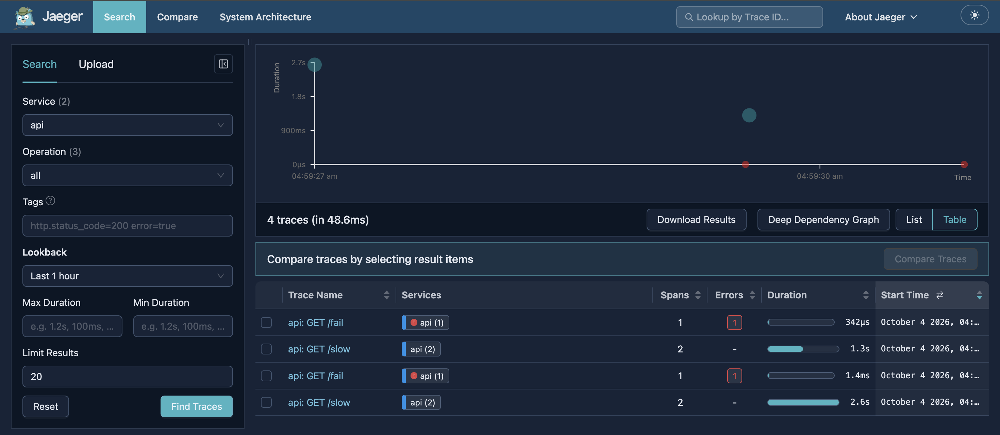

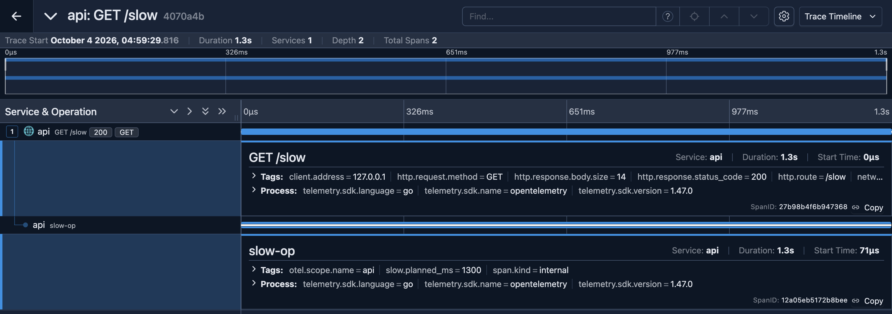

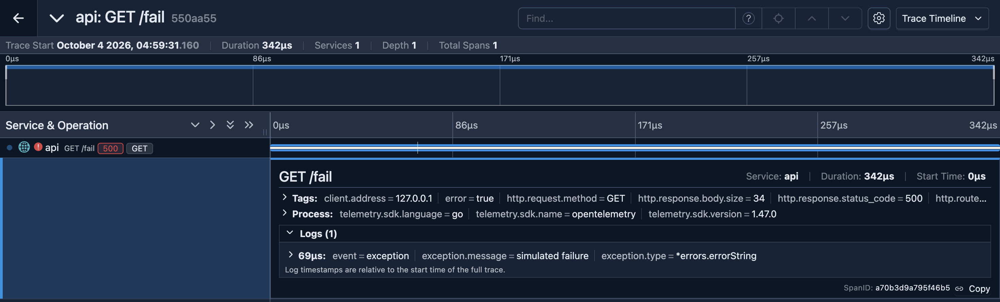

### От лога к трейсу: первое решение

Удаление старого API ударило и по Grafana: её источник данных Jaeger
опирается на `/api/services`, и проверка падает:

```text
{"message":"request failed: 404 Not Found","status":"ERROR"}
```

Первое решение было обходным: не подключать Jaeger к Grafana вовсе, а в
источник Loki добавить ссылку из `trace_id` прямо в интерфейс Jaeger. Лабе
этого формально хватает, но получается костыль: в Grafana нет трейсов, нет
перехода от спана к логам, и всё держится на адресе `port-forward`.

### Расследование: чья это проблема

Смотрим, что именно удалили и что об этом знают Grafana и Jaeger.

**Jaeger, PR [#9260](https://github.com/jaegertracing/jaeger/pull/9260)** «feat(query)!: Remove v1 HTTP endpoints the UI no
longer calls», влит 8 августа 2026, вошёл в 2.21.0. Удалены
`GET /api/services`, `GET /api/operations`,
`GET /api/services/{service}/operations` и поиск `GET /api/traces`. Поиск
трейса по ID (`/api/traces/{id}`) оставлен. Обоснование в PR: этот API в
документации Jaeger всегда был помечен как **Internal** — «intentionally
undocumented and subject to change», а стабильный и рекомендуемый — `api_v3`.
Для каждого удалённого эндпоинта в PR дана замена в `/api/v3`.

**Grafana, issue [#109728](https://github.com/grafana/grafana/issues/109728)** «Jaeger: Use GRPC endpoint instead of internal
http» и **PR [#113297](https://github.com/grafana/grafana/pull/113297)** «Jaeger: Migrate API calls to gRPC endpoint», влит
31 октября 2025. Grafana знает, что сидит на внутреннем API, и переводит
плагин на `api_v3`. Но:

```bash
curl -s https://raw.githubusercontent.com/grafana/grafana/v13.2.3/pkg/services/featuremgmt/registry.go \
  | grep -A5 'jaegerEnableGrpcEndpoint'
```

```text
Name:        "jaegerEnableGrpcEndpoint",
Description: "Enable querying trace data through Jaeger's gRPC endpoint (HTTP)",
Stage:       FeatureStageExperimental,
Expression:  "false",
```

В Grafana 13.2.3 новый клиент стоит за экспериментальным флагом и по
умолчанию выключен, а в чек-листе issue перенос поиска трейсов
(`/api/traces?service=...`) так и не отмечен — то есть даже с флагом поиск
в Grafana ходил бы в удалённый эндпоинт.

Итог: формально это не баг ни одной из сторон. Jaeger удалил API, который
никогда не обещал сохранять, а Grafana по умолчанию всё ещё на нём сидит и
мигрирует медленно.

### Решение: Jaeger 2.20.0

Варианты: остаться на 2.21 со ссылками вместо источника данных, включить
экспериментальный флаг Grafana (без поиска), или откатить Jaeger на одну
версию. В 2.20.0 (вышла 20 июля, до PR #9260) старый API ещё есть. Откатываемся: чарт 4.13.1,
values которого отличаются от 4.14.1 только образом oauth2-proxy, который
мы не используем.

```bash
helm upgrade jaeger jaegertracing/jaeger --version 4.13.1 -n monitoring -f helm/jaeger.yaml --wait
kubectl -n monitoring get deploy jaeger -o jsonpath='{.spec.template.spec.containers[0].image}'
curl -s http://localhost:16686/api/services
curl -s -u "admin:$GF_PASS" http://localhost:3000/api/datasources/uid/jaeger/health
```

```text
jaegertracing/jaeger:2.20.0
{"data":["api","jaeger"],"total":2,"limit":0,"offset":0,"errors":null}
{"message":"Data source is working","status":"OK"}
```

Теперь связь двусторонняя
([`helm/kube-prometheus-stack.yaml`](helm/kube-prometheus-stack.yaml)):

- **лог → трейс.** В источнике Loki два derived field из `trace_id`:
  «Trace in Grafana» открывает трейс через источник Jaeger прямо в Grafana,
  «Open in Jaeger UI» — в самом интерфейсе Jaeger;
- **трейс → логи.** У источника Jaeger `tracesToLogsV2`: из спана можно
  перейти к строкам лога с тем же `trace_id` —
  `{namespace="app", app="api"} | trace_id="${__trace.traceId}"`.

```yaml
derivedFields:
  - name: TraceID
    matcherType: label
    matcherRegex: trace_id
    datasourceUid: jaeger
    url: "$${__value.raw}"
    urlDisplayLabel: Trace in Grafana
  - name: TraceID
    matcherType: label
    matcherRegex: trace_id
    url: "http://localhost:16686/trace/$${__value.raw}"
    urlDisplayLabel: Open in Jaeger UI
```

`$$` — экранирование: при провижининге Grafana подставляет переменные
окружения вида `$NAME`.

Проверка цепочки: берём `trace_id` из свежего лога `/fail` и достаём трейс
через источник Jaeger в Grafana (тем же путём, что и интерфейс):

```bash
TID=$(kubectl -n app logs deploy/api --since=1m | grep '"route":"/fail"' | tail -1 | jq -r .trace_id)
curl -s -u "admin:$GF_PASS" "http://localhost:3000/api/datasources/proxy/uid/jaeger/api/traces/$TID"
```

```text
trace from log: 550aa555e8d6261ba227998ef1a946de
GET /fail 342 us otel.status_code= ERROR error= True
```

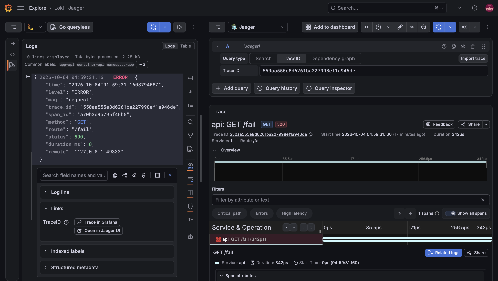

---

## Часть 4. Алерты: Alertmanager и Karma

Задача — описать три действительно критичных алерта на PromQL, подключить
Alertmanager с получателем, поднять поверх него Karma, спровоцировать
алерты и показать их в состоянии firing.

### Получатель, Alertmanager, Karma

**Получатель** — маленький echo-сервер `mendhak/http-https-echo:42` из
своего мини-чарта [`charts/alert-receiver/`](charts/alert-receiver/): каждое
уведомление он пишет в лог одной JSON-строкой с полным телом. Так
срабатывание видно и в `kubectl logs`, и в Loki.

**Alertmanager** настраивается в values kube-prometheus-stack
([`helm/kube-prometheus-stack.yaml`](helm/kube-prometheus-stack.yaml)):

```yaml
alertmanager:
  config:
    route:
      receiver: webhook
      group_by: [alertname, namespace]
      group_wait: 10s
      group_interval: 1m
      repeat_interval: 1h
      routes:
        - receiver: "null"
          matchers: ['alertname = "Watchdog"']
        - receiver: "null"
          matchers: ['alertname = "InfoInhibitor"']
    inhibit_rules:
      - source_matchers: ['severity = "critical"']
        target_matchers: ['severity = "warning"']
        equal: [alertname, namespace]
    receivers:
      - name: "null"
      - name: webhook
        webhook_configs:
          - url: http://alert-receiver.monitoring.svc:8080/alertmanager
            send_resolved: true
```

- `group_by` — алерты с одинаковыми `alertname` и `namespace` уходят одним
  уведомлением; `group_wait` ждёт «соседей» перед первым,
  `group_interval` — как часто пересылать изменившуюся группу,
  `repeat_interval` — как часто напоминать о неизменной.
- `Watchdog` горит всегда, нарочно: это проверка, что сама цепочка алертинга
  жива. Отправлять его дежурному незачем — он уходит в `null`.
- `inhibit_rules` — critical глушит warning с тем же именем и namespace.

**Karma** ([`helm/karma.yaml`](helm/karma.yaml)) — чарт `zekker6/karma`,
адрес Alertmanager задаётся переменной `ALERTMANAGER_URI`.

```bash
helm upgrade --install alert-receiver charts/alert-receiver -n monitoring --wait
helm upgrade kps prometheus-community/kube-prometheus-stack --version 91.8.2 \
  -n monitoring -f helm/kube-prometheus-stack.yaml --wait
helm repo add zekker6 https://zekker6.github.io/helm-charts
helm upgrade --install karma zekker6/karma --version 0.22.0 -n monitoring -f helm/karma.yaml --wait
curl -s http://localhost:9093/api/v2/alerts
```

```text
NodeClockNotSynchronising warning active
Watchdog none active
```

Сразу горело постороннее предупреждение `NodeClockNotSynchronising` — одно
из стандартных правил kube-prometheus-stack. Нода minikube — контейнер без
NTP, правило горит всегда и только засоряет Alertmanager и Karma. Выключено
через `defaultRules.disabled`.

Karma отдаёт данные только на POST — проверка, что она видит Alertmanager:

```bash
curl -s -X POST -H 'Content-Type: application/json' -d '{"filters":[]}' http://localhost:8081/alerts.json
```

```text
karma upstreams: [('lab-2', 'http://kps-alertmanager.monitoring.svc:9093', 'ok')]
```

### Три критичных алерта

Алерты придуманы от боли пользователя и здоровья сервиса, лежат как
PrometheusRule в чарте сервиса
([`charts/api/templates/prometheusrule.yaml`](charts/api/templates/prometheusrule.yaml)),
у каждого — ранбук в [`runbooks/`](runbooks/) со ссылкой в аннотации
`runbook_url`.

| Алерт | Условие | Что ловит | Почему важно | Ранбук |
|---|---|---|---|---|
| `ApiHighErrorRate` | доля 5xx > 5% за 2 мин, `for: 2m`, при трафике > 0.1 req/s | пользователи получают ошибки | каждый двадцатый запрос падает; клиенты с повторами добавляют нагрузку | [ApiHighErrorRate.md](runbooks/ApiHighErrorRate.md) |
| `ApiHighLatency` | p95 **по маршруту** > 2 с за 5 мин, `for: 3m`, при трафике на маршрут > 0.05 req/s | пользователи ждут | часть клиентов упирается в таймауты | [ApiHighLatency.md](runbooks/ApiHighLatency.md) |
| `ApiDown` | `absent(up{job="api"} == 1)`, `for: 1m` | сервиса нет или мы его не видим | либо полный отказ, либо мониторинг ослеп и остальные алерты не сработают | [ApiDown.md](runbooks/ApiDown.md) |

Почему именно так:

- **Порог по трафику** в `ApiHighErrorRate`: при одной ошибке из двух
  запросов доля — 50%, и алерт будил бы ночью из-за двух запросов.
- **p95 по маршруту, а не по сервису**: в части 2 общий p95 был 4.84 мс,
  пока `/slow` отвечал по 3 секунды. Алерт на общий p95 молчал бы.
- **`absent()`, а не `up == 0`**: когда подов нет, цель исчезает из
  Prometheus целиком, у `up` нет ни одной серии, и `up == 0` никогда бы не
  сработал.

Каждый ранбук: что это значит для пользователя → как подтвердить (PromQL,
дашборд) → где искать причину (LogQL, трейсы, `kubectl`) → таблица «причина
→ действие» с командами → что сделать после.

Ещё идеи, которые не реализованы, но напрашиваются:

- **SLO burn rate** вместо фиксированных 5%: скорость сжигания бюджета
  ошибок в двух окнах (например, 1 ч и 5 мин) ловит и быструю, и медленную
  деградацию с меньшим числом ложных тревог.
- **«Трафика нет»**: `rate == 0` при живых подах — сломан ingress или DNS.
  Возможно только потому, что пробы ходят в отдельный `/healthz`; требует
  реального фонового трафика.
- **Мониторинг мониторинга**: `Watchdog` во внешний dead man's switch
  (например, healthchecks.io) — тишина от него значит, что сломался сам
  Prometheus или Alertmanager.

```bash
helm upgrade api charts/api -n app -f helm/api.yaml --wait
kubectl -n app get prometheusrule
```

```text
NAME   AGE
api    0s
```

### Провоцируем: ошибки и задержка

Семь минут каждые две секунды: пачка `/health`, пачка `/fail` (около 20%
ошибок) и `/slow` (p95 около 2.9 с):

```bash
B=http://127.0.0.1:18080
end=$((SECONDS+420))
while [ $SECONDS -lt $end ]; do
  curl -s "$B/load?n=40" >/dev/null
  curl -s "$B/load?path=/fail&n=10" >/dev/null
  curl -s $B/slow >/dev/null &
  sleep 2
done
```

```bash
curl -s http://127.0.0.1:19090/api/v1/alerts
curl -s http://localhost:9093/api/v2/alerts
kubectl -n monitoring logs deploy/alert-receiver | grep '"path":"/alertmanager"'
```

```text
06:52:57
ApiHighErrorRate  firing api: 18.88% of requests fail
ApiHighLatency /slow firing api /slow: p95 is 2.888s

== Alertmanager:
  ApiHighErrorRate  critical active receivers: ['webhook']
  Watchdog  none active receivers: ['null']
  ApiHighLatency /slow critical active receivers: ['webhook']
== webhook receiver:
  status: firing group: {'alertname': 'ApiHighErrorRate', 'namespace': 'app'} alerts: [('ApiHighErrorRate', '', 'firing')]
  status: firing group: {'alertname': 'ApiHighLatency', 'namespace': 'app'} alerts: [('ApiHighLatency', '/slow', 'firing')]
```

Весь путь работает: Prometheus → Alertmanager (маршрут `webhook`, группа
на алерт) → получатель. `Watchdog` ушёл в `null`.

В интерфейсе Alertmanager нет цветового статуса firing: на вкладке Alerts
по умолчанию показываются только активные алерты, свёрнутые в группы по
`group_by`, а перед группой — получатель.

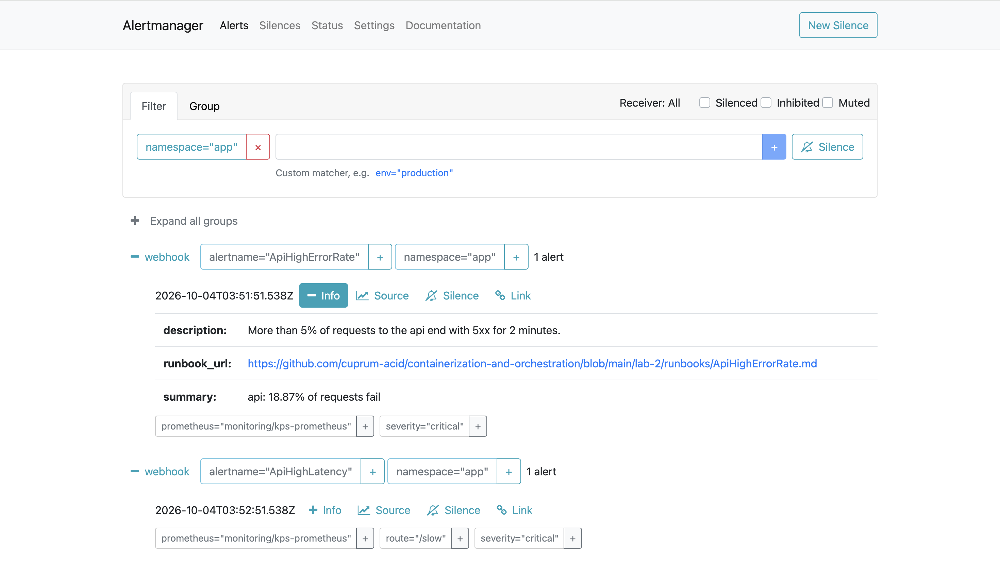

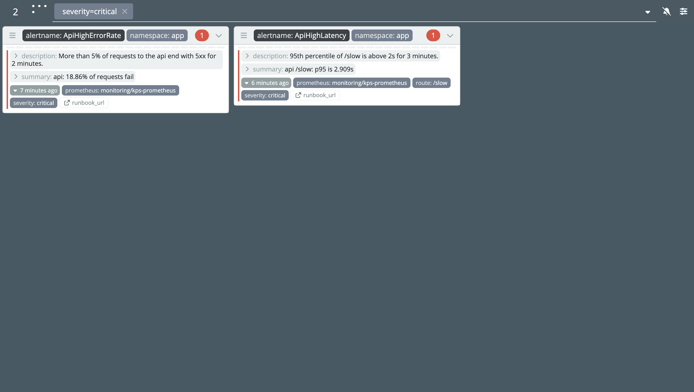

### Провоцируем: сервис недоступен

```bash
kubectl -n app scale deploy/api --replicas=0
```

```text
07:07:40
deployment.apps/api scaled
07:09:53
 prometheus: ApiHighLatency /slow firing
 prometheus: ApiDown  firing
 alertmanager: ApiDown active ['webhook']
 alertmanager: ApiHighLatency active ['webhook']
 webhook: firing [('ApiHighLatency', 'firing')]
 webhook: resolved [('ApiHighErrorRate', 'resolved')]
 webhook: firing [('ApiDown', 'firing')]
```

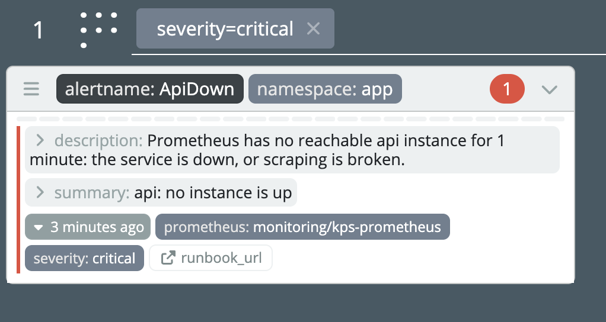

Возвращаем сервис через Helm, а не `kubectl scale` — так, как советует
ранбук: состояние кластера снова совпадает с values, и следующий
`helm upgrade` ничего не перетрёт.

```bash
helm upgrade api charts/api -n app -f helm/api.yaml --wait
kubectl -n monitoring logs deploy/alert-receiver | grep '"path":"/alertmanager"' | tail -2
```

```text
NAME                   READY   STATUS    RESTARTS   AGE
api-5564c586b9-2h4ck   1/1     Running   0          3s
 webhook: resolved [('ApiHighLatency', 'resolved')]
 webhook: resolved [('ApiDown', 'resolved')]
```

Через минуту после возврата получатель получил `resolved` и для `ApiDown`
(минута — это `group_interval`).

---

## Экстра. Второй агент логов: Vector

Лаба говорит, что агент сбора — сменная часть: Alloy, Promtail (который, кстати [deprecated](https://grafana.com/docs/loki/latest/send-data/promtail/)) или Fluent
Bit, а Loki — только хранилище. Проверяем это на практике: ставим рядом с
Alloy второй агент, [Vector](https://vector.dev/), так, чтобы ничего не сломать и ни одна строка не
попала в Loki дважды, и заодно показываем, что Vector умеет менять строку на
лету.

### Как не задвоить логи

Работа делится по namespace: **Vector забирает логи `app`, Alloy — всё
остальное**. В Alloy добавлено правило, которое отбрасывает поды `app`, и
статическая метка `agent="alloy"`
([`helm/alloy.yaml`](helm/alloy.yaml)):

```alloy
rule {
  source_labels = ["__meta_kubernetes_namespace"]
  regex         = "app"
  action        = "drop"
}
...
stage.static_labels {
  values = { agent = "alloy" }
}
```

Vector при первом запуске по умолчанию читает файлы логов **с начала** — вся
история `api`, уже доставленная Alloy, ушла бы в Loki второй раз. Поэтому
`read_from: end`.

### Конфиг Vector

Vector 0.58.0 (чарт `vector/vector` 0.58.0, роль `Agent` — DaemonSet),
конфиг — [`helm/vector.yaml`](helm/vector.yaml), программа VRL — отдельный
файл [`helm/files/api.vrl`](helm/files/api.vrl). Конвейер из трёх частей:

- **source** `kubernetes_logs` — только поды `app`
  (`extra_field_selector: metadata.namespace=app`);
- **transform** `remap` на VRL — разбирает JSON, дописывает в строку
  `vector_says: "привет из Vector"`, достаёт `level` и `trace_id`;
- **sink** `loki` — те же метки, что даёт Alloy (`namespace`, `pod`,
  `container`, `app`, `level`), плюс `agent="vector"`; `trace_id` — в
  structured metadata.

```vrl
.app = string(.kubernetes.pod_labels."app.kubernetes.io/name") ?? "unknown"
parsed, err = parse_json(.message)
if err == null && is_object(parsed) {
  parsed.vector_says = "привет из Vector"
  .level = string(parsed.level) ?? "unknown"
  .trace_id = string(parsed.trace_id) ?? ""
  .message = encode_json(parsed)
}
```

Метки те же, что у Alloy, поэтому все запросы в Grafana, RED-workflow и
переход от лога к трейсу продолжают работать без изменений.

### Три сбоя по дороге

**Конфликт шаблонизаторов.** Первая установка упала:

```text
Error: ... error calling tpl: cannot parse template ... function "app" not defined
```

Чарт Vector прогоняет `customConfig` через Helm `tpl`, и шаблоны самого
Vector вида `{{ app }}` Helm принимает за свои. Экранирование —
`'{{ "{{ app }}" }}'`: Helm превращает это обратно в `{{ app }}`, и до Vector
доходит нужный шаблон.

**Service без портов.**

```text
Error: server-side apply failed for object monitoring/vector /v1, Kind=Service: Service "vector" is invalid: spec.ports: Required value
```

Чарт выводит порты Service из источников, которые слушают сеть. Наш агент
только читает файлы, портов нет, и Service получается невалидным. Агенту
Service не нужен — `service.enabled: false`.

**VRL проверяется при компиляции.** Под упал в CrashLoop:

```text
ERROR vector::topology::builder: Configuration error. error=Transform "api_json":
error[E651]: unnecessary error coalescing operation
1 │ .app = .kubernetes.pod_labels."app.kubernetes.io/name" ?? "unknown"
  │        this expression can't fail
```

VRL — типизированный язык: обращение к полю не может упасть (отсутствующее
поле — это `null`), поэтому `??` («если ошибка») бессмыслен, и Vector
отказывается стартовать с таким конфигом. `string()` на `null` падает — с ним
`??` нужен.

```bash
helm repo add vector https://helm.vector.dev
make deploy-alloy    # проверка конфигов + helm upgrade с --set-file
make deploy-vector
kubectl -n monitoring logs ds/vector | grep started
```

```text
INFO vector: Vector has started. debug="false" version="0.58.0" arch="aarch64"
```

### Проверка

Отправляем ровно пять `/fail` и смотрим в Loki, кто что доставил:

```bash
for i in 1 2 3 4 5; do curl -s -o /dev/null -w '%{http_code} ' http://127.0.0.1:18080/fail; done
```

```logql
sum by (namespace, agent) (count_over_time({namespace=~".+"} [2m]))
sum by (agent) (count_over_time({namespace="app", app="api", level="ERROR"} | json | msg="request" | route="/fail" [1m]))
{namespace="app", agent="vector", level="ERROR"}
```

```text
500 500 500 500 500
== строки за последние 2 мин по namespace и agent:
   {'agent': 'alloy', 'namespace': 'kube-system'} 177
   {'agent': 'alloy', 'namespace': 'monitoring'} 2269
   {'agent': 'vector', 'namespace': 'app'} 11
== строк request /fail за 1 мин (отправлено 5):
   {'agent': 'vector'} 5
== одна строка от Vector:
   labels+metadata: {'agent': 'vector', 'app': 'api', 'level': 'ERROR', 'namespace': 'app', 'pod': 'api-5564c586b9-2h4ck', 'trace_id': '5c54cd1c4954c08798177a7aca1ef311'}
   line: {"duration_ms":0,"level":"ERROR","method":"GET","msg":"request","remote":"127.0.0.1:44626","route":"/fail","span_id":"fcc062a010dac384","status":500,"time":"2026-10-04T05:03:22.50881392Z","trace_id":"5c54cd1c4954c08798177a7aca1ef311","vector_says":"привет из Vector"}
```

- Логи `app` доставляет только Vector, остальное — только Alloy.
- Пять запросов — ровно пять строк: дублей нет.
- В строке появилось `"vector_says":"привет из Vector"`, `trace_id` на месте.
- Ключи JSON отсортированы по алфавиту: Vector действительно разобрал
  строку и собрал её заново (`encode_json`), а не передал как есть.

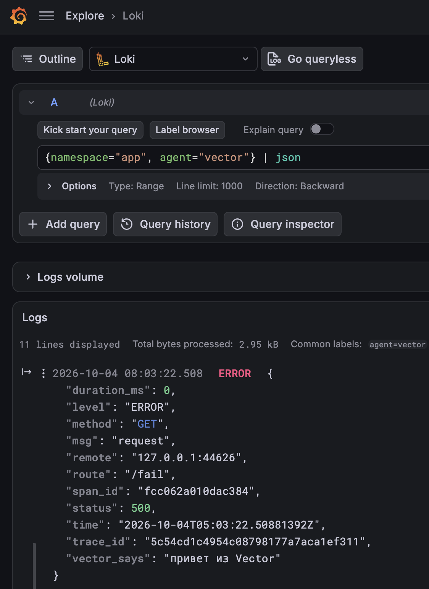

### Alloy и Vector

| | Alloy | Vector |
|---|---|---|
| Язык конфига | Alloy (River): компоненты, связанные ссылками | TOML/YAML: sources → transforms → sinks |
| Обработка строки | набор готовых стадий (`stage.json`, `stage.labels`, ...) | VRL — полноценный типизированный язык, проверяется при компиляции |
| Экосистема | Grafana: Loki, Mimir, Tempo, Pyroscope | вендор-нейтральный, десятки sink'ов |
| В этой лабе | собирает всё, кроме `app` | собирает `app` и дописывает поле |

Loki всё равно, кто ему пишет: обоим агентам нужен только его push-API и
одинаковые метки.

---

## Кластер глазами k9s

Напоследок — что в итоге развёрнуто в кластере, через k9s v0.51.0.

**Helm-релизы** (`:helm`, `0` — все namespace): восемь релизов, всё, что
ставилось в лабе. В колонке REVISION видна история.

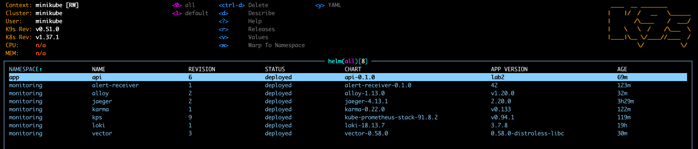

**Поды** (`:pods`, `0`): 21 под в трёх namespace — `app` (сервис),
`kube-system` (сам Kubernetes) и `monitoring` (весь стек).

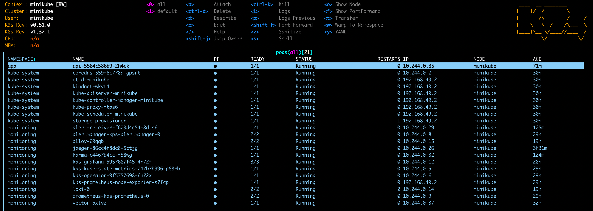

**DaemonSet'ы** (`:ds`, `0`): всё, что должно работать на каждой ноде, —
`kindnet` и `kube-proxy` от Kubernetes, `kps-prometheus-node-exporter`
(метрики ноды), `alloy` и `vector` (агенты логов). Нода одна, поэтому у
каждого 1/1.

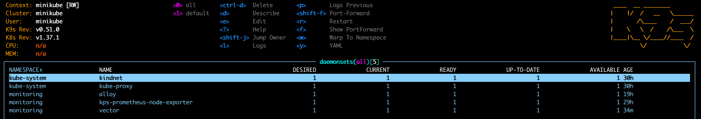

**Дерево сервиса** (`:xray deploy app`): Deployment `api` → его ReplicaSet →
под → контейнер `api` и ServiceAccount `default`.

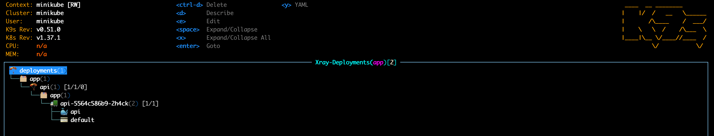
